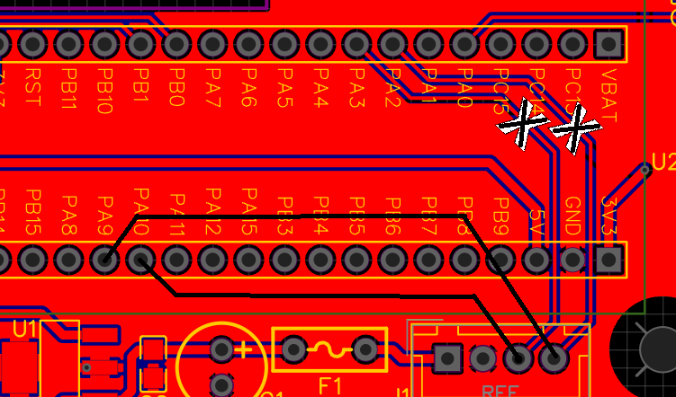

# Modifikation des AC-Voltmeter-Prints — Controller-Link auf USART1

*Ohne Gewähr — diese Unterlagen beschreiben ein selbstgebautes Gerät am
230-V-Netz. Wer danach baut oder misst, tut das auf eigene Verantwortung.
Siehe [Haftungsausschluss](../README.md#haftungsausschluss).*

Betrifft **Trenntrafo_AC_Voltmeter, rev. 1.0** ([`PCB/Voltmeter/`](PCB/Voltmeter/))
mit STM32F103 „Blue Pill". Der Umbau ist im Gerät ausgeführt. Wer die Platine
nachbaut oder ersetzt, muss ihn mit ausführen, sonst kommt keine Verbindung zum
Controller zustande.

> Vor dem Eingriff das Gerät vom Netz trennen. Der Print führt im Betrieb an
> `J2` AC Input Netzspannung.

## Warum

Die serielle Verbindung zum ESP32-Controller lag ursprünglich auf **USART2
(PA2/PA3)** und war nur in eine Richtung geführt. Sie ist auf **USART1
(PA9/PA10)** verlegt und bidirektional ausgeführt. Drei Gründe:

1. **Befehls- und Antwortverkehr.** Der Controller soll Voltmeter-Funktionen
   — Status, Version, Live-Werte, Skalierungsfaktor, Kalibrierung — über die
   Weboberfläche ansteuern können. Dafür braucht das Voltmeter eine
   Empfangsrichtung.
2. **Firmware-Update über den Controller.** Der eingebaute ROM-UART-Bootloader
   des STM32F103 liegt auf USART1 (PA9/PA10). Nur über diese Leitung ist ein
   Update des Voltmeters über den Controller ohne eigenen Bootloader möglich
   (ST AN3155).
3. **Die Konsole braucht PA9/PA10 nicht mehr.** Sie läuft seit Firmware V1.1.0
   über die native USB-CDC der Blue Pill (PA11/PA12) und ist damit unabhängig
   vom Controller-Link.

## Der Umbau

1. **Die Verbindungen zu PA2 und PA3 auftrennen** (Abb. 1, die beiden weissen
   Kreuze).
2. **Neue Verbindungen von PA9 und PA10 zum Host-Stecker legen** (Abb. 1, die
   beiden schwarzen Linien).
3. **Gemeinsames GND** zwischen Voltmeter und Controller sicherstellen.

**Abb. 1** — Ausschnitt des Layouts am Blue-Pill-Fussabdruck. Weisse Kreuze: die
beiden Trennstellen an PA2 und PA3. Schwarze Linien: die neuen Verbindungen von
PA9 und PA10 zum Host-Stecker.

## Belegung nach dem Umbau

| Signal | Voltmeter (STM32) | Controller (ESP32-S3) | Richtung |
|--------|-------------------|------------------------|----------|
| Daten Voltmeter → Controller | **PA9** (USART1 TX) | GPIO **17** | → |
| Befehle Controller → Voltmeter | **PA10** (USART1 RX) | GPIO **18** | ← |
| Masse | GND | GND | — |

Baudrate **115200, 8N1**.

> **Cross-over beachten:** TX des einen Geräts geht an RX des anderen —
> PA9 → GPIO 17 und GPIO 18 → PA10.

Die Konsole bleibt davon unberührt:

| Funktion | Pins | Anschluss |
|----------|------|-----------|
| Menü und Debug | PA11 / PA12 | USB-Port der Blue Pill (USB-CDC) |
| Firmware flashen (Entwicklung) | SWDIO / SWCLK | ST-Link (SWD) |

## Folgen für den Rest des Geräts

**PA2 und PA3 werden für den Link nicht mehr verwendet.**

**Der Link ist bidirektional.** Darüber läuft auch das Firmware-Update des
Voltmeters über den Controller. Das Protokoll steht in
[`../tt_voltmeter/documentation/Link-Protokoll.md`](../tt_voltmeter/documentation/Link-Protokoll.md).

An der Verdrahtung ändert sich nichts: `J1` HOST bleibt die vierpolige
Verbindung zum Controller-Print `J6` UART — siehe
[`Verdrahtung.md`](Verdrahtung.md), Abschnitt 3.3.

## Beim Neuauflegen der Platine

Wer eine neue Revision zeichnet, führt den Host-Link gleich auf PA9/PA10 und
lässt PA2/PA3 frei.
