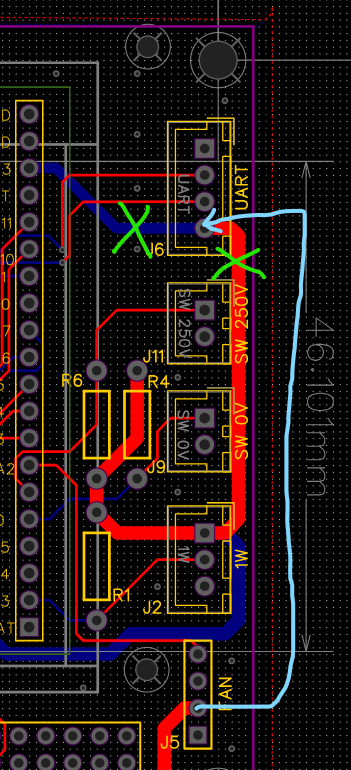

# Modifikation des Controller-Prints — 12 V für das AC-Voltmeter

*Ohne Gewähr — diese Unterlagen beschreiben ein selbstgebautes Gerät am
230-V-Netz. Wer danach baut oder misst, tut das auf eigene Verantwortung.
Siehe [Haftungsausschluss](../README.md#haftungsausschluss).*

Betrifft **Trennstelltrafo Controller, 2020 rev. 2**
([`PCB/Controller/`](PCB/Controller/)). Der Umbau ist im Gerät ausgeführt. Wer
die Platine nachbaut oder ersetzt, muss ihn mit ausführen, sonst bekommt das
AC-Voltmeter keine Speisung.

> Vor dem Eingriff das Gerät vom Netz trennen.

## Warum

Das AC-Voltmeter hängt am Stecker `J6` (UART) des Controller-Prints und braucht
über dieselbe Leitung seine Speisung mit 12 V. Im Originalzustand liegt `J6`
Pin 4 aber auf +3,3 V.

## Der Umbau

1. **`J6` Pin 4 isolieren.** Die Leiterbahnen zu diesem Pin auf Ober- und
   Unterseite auftrennen (Abb. 1, die beiden grünen Kreuze).
2. **Die 12 V von `J5` Pin 2 abgreifen** und auf `J6` Pin 4 legen (Abb. 1, die
   hellblaue Linie).

**Abb. 1** — Ausschnitt des Layouts um `J6` (UART) und `J5` (FAN). Grüne Kreuze:
die beiden Trennstellen. Hellblaue Linie: die neue Verbindung von `J5` Pin 2 auf
`J6` Pin 4.

## Folgen für den Rest des Geräts

**`J6` Pin 4 führt danach +12 V statt +3,3 V.** Schema und Aufdruck stimmen an
dieser Stelle nicht mehr. Wer ein anderes Gerät an `J6` steckt, muss das wissen.

**`J5` (FAN) und `J6` (UART) teilen sich die 12-V-Speisung.** Beide hängen damit
am selben Zweig hinter den Sicherungen `F3`/`F4` der Leistungsplatine.

An der Verdrahtung ändert sich nichts: `J6` bleibt die vierpolige Verbindung zum
AC-Voltmeter-Print `J1` HOST — siehe [`Verdrahtung.md`](Verdrahtung.md),
Abschnitt 2.2.

## Beim Neuauflegen der Platine

Wer eine neue Revision zeichnet, legt `J6` Pin 4 gleich auf 12 V statt auf
+3,3 V.
