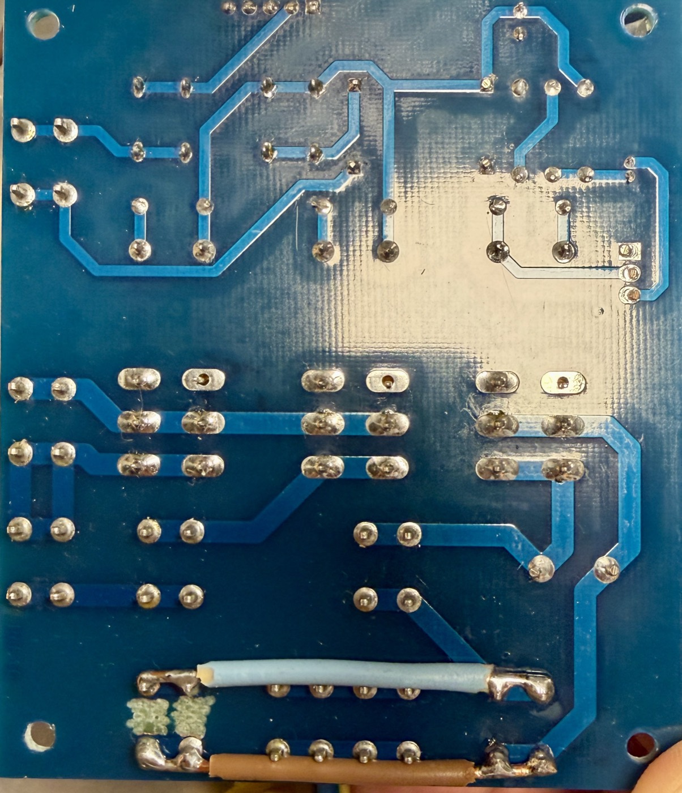
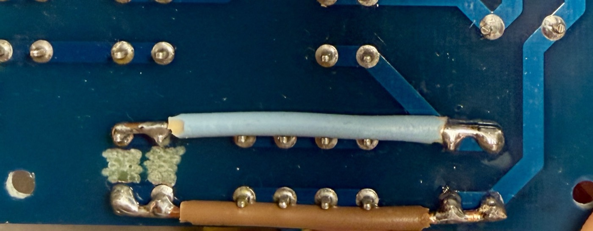

# Modifikation der Leistungsplatine — Speisung des Netzteils

*Ohne Gewähr — diese Unterlagen beschreiben ein selbstgebautes Gerät am
230-V-Netz. Wer danach baut oder misst, tut das auf eigene Verantwortung.
Siehe [Haftungsausschluss](../README.md#haftungsausschluss).*

Betrifft **Power-Board Trennstelltrafo, 2020 rev. 1** ([`PCB/Power/`](PCB/Power/)).
Der Umbau ist im Gerät ausgeführt. Wer die Platine nachbaut oder ersetzt, muss ihn
mit ausführen, sonst bekommt das Netzteil keine Spannung.

> **230 V.** Der Umbau liegt im Netzteil der Primärseite. Vor jedem Eingriff das
> Gerät vom Netz trennen.

## Warum

Die Leistungsplatine hat im Originalzustand keinen Abgriff für 230 V. Sie führt
Netzspannung nur zwischen ihren eigenen Fahnen — Eingang, Hauptschalter,
Sanftanlauf, Transformator — und gibt nichts davon nach aussen weiter. Das
24-V-Netzteil Mean Well LRS-75-24 braucht aber eine Netzzuleitung, und im Gerät
gibt es sonst keine Klemmstelle dafür.

Die Modifikation schafft diesen Abgriff, indem der Schutzleiterblock der Platine
umgewidmet wird.

## Ausgangszustand

Auf der Platine tragen die beiden Fahnen `S22` und `S23` die Aufdrucke `PE` und
`PE Case`. Im Schema bilden sie zusammen das Netz `PE`: Sie sind untereinander
verbunden und gehen auf das Erdungssymbol — mehr nicht. Es führt keine weitere
Leiterbahn von diesem Netz weg. Der Block ist also nur ein Sammelpunkt für den
Schutzleiter und hat keine Funktion in der Schaltung.

## Der Umbau

1. **Die Verbindung zwischen `S22` und `S23` auftrennen.** Im Gerät ist das
   Kupfer auf der Lötseite auf zwei Feldern weggefräst (Abb. 2, die beiden hellen
   Stellen zwischen den Fahnen).
2. **Von jeder der beiden Fahnen eine isolierte Brücke auf der Lötseite legen** —
   von `S22` auf `S14` (`L`) und von `S23` auf `S17` (`N`). Im Gerät ist die eine
   Brücke hellblau isoliert, die andere braun.

Danach ist der Block kein Schutzleiteranschluss mehr, sondern der 230-V-Abgriff
für das Netzteil.

**Abb. 1** — Die Lötseite der umgebauten Leistungsplatine. Die Modifikation liegt
am unteren Rand.

**Abb. 2** — Links die beiden Fahnen `S22` und `S23` mit den zwei weggefrästen
Feldern dazwischen, von dort die hellblaue und die braune Brücke nach rechts.

## Folgen für den Rest des Geräts

**Die Leistungsplatine hat keinen Schutzleiteranschluss mehr.** Alle PE-Adern des
Geräts laufen direkt auf den Erdungsbolzen der Rückwand — Kaltgerätestecker,
gelbe T13-Steckdose, Gehäuseboden, Gehäusedeckel, Netzteil, Frontplatte und die
PE-Anschlüsse der Frontplatte. Die Aufstellung steht in
[`Verdrahtung.md`](Verdrahtung.md), Abschnitt 1.2.

**Der Aufdruck auf dem Print stimmt nicht mehr.** `PE` und `PE Case` führen jetzt
230 V. Wer an der Platine arbeitet, darf sich nicht auf die Beschriftung
verlassen.

**Am Netzteil liegt braun auf `L` und blau auf `N`**, der Schutzleiter kommt
gelb-grün vom Erdungsbolzen. Das Foto der Anschlussleiste steht in
[`Verdrahtung.md`](Verdrahtung.md), Abb. 3.

## Wo die Brücken abgreifen

Die beiden Brücken gehen auf **`S14`** und **`S17`**, also auf die Fahnen
**hinter** dem Hauptschalter. Damit gilt:

- Das Netzteil schaltet mit dem Hauptschalter ein und aus. Mit eingestecktem
  Netzkabel und ausgeschaltetem Hauptschalter ist das Gerät stromlos.
- Der Leitungsschutzschalter `PRI` liegt im Pfad davor und schützt das Netzteil
  mit.
- Der Abgriff liegt **vor** dem Sanftanlaufwiderstand `R4`: dieser sitzt
  zwischen `S14` und `S15` und wirkt nur auf den Transformator, nicht auf das
  Netzteil.

**`S22` führt `L`, `S23` führt `N`.** Das passt zur Aderfarbe der Zuleitung zum
Netzteil: braun auf `S22`, blau auf `S23`.

## Beim Neuauflegen der Platine

Wer eine neue Revision der Platine zeichnet, nimmt den Abgriff besser gleich ins
Layout auf — als eigenes Fahnenpaar mit eigenem Aufdruck — und lässt den
Schutzleiterblock entweder weg oder behält ihn als das, was der Aufdruck sagt.
