# Stückliste — TWM Isolation Variac

*Ohne Gewähr — diese Unterlagen beschreiben ein selbstgebautes Gerät am
230-V-Netz. Wer danach baut oder misst, tut das auf eigene Verantwortung.
Siehe [Haftungsausschluss](../README.md#haftungsausschluss).*

Motorisierter Trenn-/Stelltransformator. Ein Schrittmotor fährt über einen
Zahnriemen den Schleifer eines Ringkerns, ein ESP32-S3 regelt die Ausgangsspannung,
ein eigenes AC-Voltmeter mit STM32 misst sie zurück.

Diese Liste nennt die Baugruppen und Bauteile mit ihren Daten und ist für die
Beschaffung gedacht. Wie die Teile untereinander verbunden sind, steht in
[`Verdrahtung.md`](Verdrahtung.md).

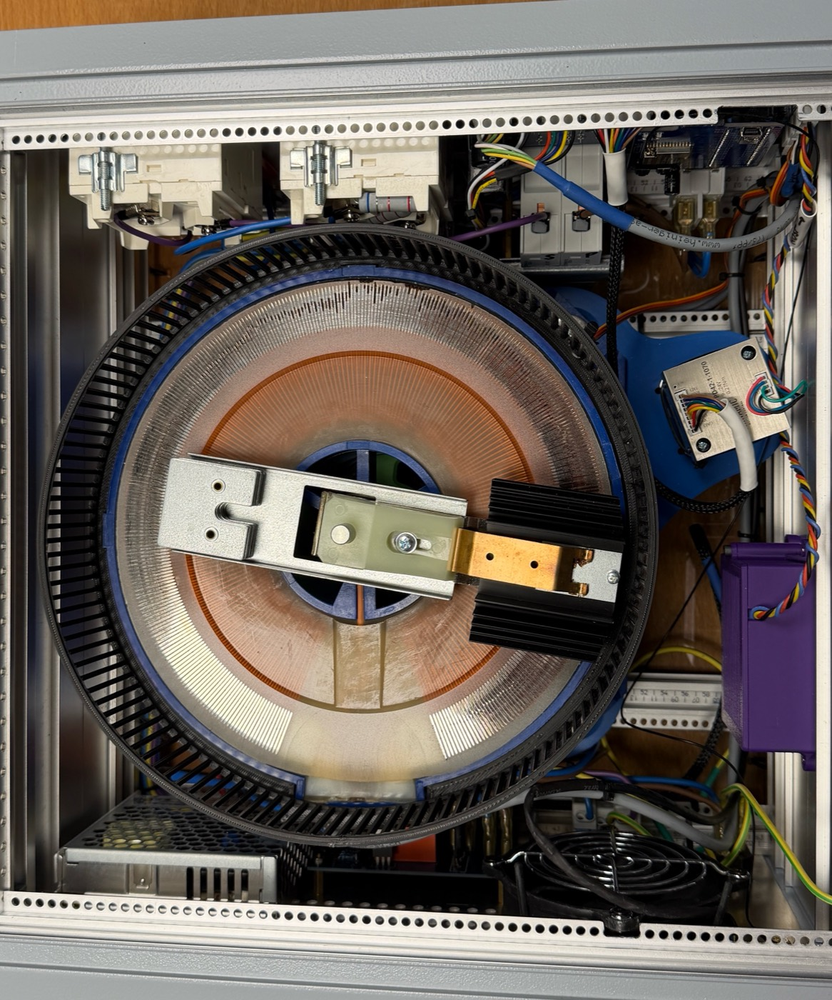

**Abb. 1** — Das geöffnete Gerät von oben. Mitte der Ringkern mit Zahnkranz und
Schleiferwagen, unten links das Netzteil auf der Rückplatte, rechts das
AC-Voltmeter im gedruckten Gehäuse, oben die Tragschiene mit den Installationsgeräten.

---

## 1 Trenn-/Stelltransformator

Der Ringkern trennt das Gerät galvanisch vom Netz und liefert über seinen
Schleifer die stufenlos einstellbare Ausgangsspannung.

**Thalheimer ETS 230/253/5** — Einphasen-Trennstelltransformator nach EN 61558.
Datenblätter: `ETS 230-253-5.pdf` (Hersteller), `17C_001.pdf` (intronic, mit
Massblatt).

| | |
|---|---|
| Eingang | 230 V, 50/60 Hz, 6,0 A |
| Ausgang | < 1 … 253 V, Dauerbelastbarkeit 5,0 A |
| Prüfspannung PRI–SEC | 4 kV~ |
| Isolierstoffklasse | B, max. Umgebungstemperatur +45 °C |
| Schutzklasse / Schutzgrad | 0 / IP00 |
| Anschlüsse | Schraubklemmen `230` · `0` · `A` · `S` · `E` |
| Abmessungen / Gewicht | 243 × 231 × 121 mm, Achse 32 mm · 14,0 kg |

Der Schleiferwagen gehört zum Lieferumfang des Transformators (Abb. 2).

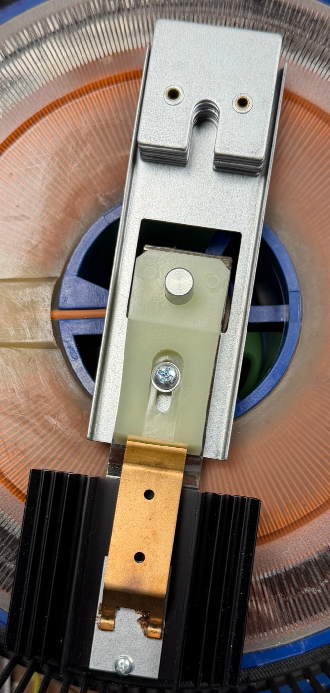

**Abb. 2** — Der Schleiferwagen auf dem Ringkern: Führungsschiene, Isolierstück,
Kohlebürste am Kupferwinkel und Kühlkörper.

---

## 2 Antrieb

Der Antrieb dreht den Schleifer des Transformators. Der Schrittmotor treibt über
einen Zahnriemen den Zahnkranz auf dem Rotor; der Endschalter gibt dem Controller
die Referenzposition.

| Menge | Bauteil | Typ / Daten | Funktion |
|-------|---------|-------------|----------|
| 1 | Schrittmotor mit integriertem Controller | **Trinamic PANdrive PD42-1-1070** · 9 … 24 V · 0,27 Nm · STEP/DIR und TMCL-UART | treibt den Schleifer |
| 1 | Endschalter | **Micro Switch V-156-1C25** · 15 A 1/2 HP 125/250 V~ · 0,6 A 125 V= · 0,3 A 250 V= | meldet den Endanschlag |
| 1 | Zahnriemen, geschlossen | Profil und Länge nach dem CAD-Modell | überträgt die Drehung |
| 1 | Zahnscheibe gross (3D-Druck) | Geometrie aus dem CAD-Modell | auf der Variac-Achse |
| 1 | Zahnscheibe klein, Motorritzel (Alu) | Geometrie aus dem CAD-Modell | auf der Motorwelle |
| 1 | Spannrolleneinheit (3D-Druck) mit zwei Lagern | Geometrie aus dem CAD-Modell | spannt den Riemen |
| 1 | Zahnkranz am Variac-Rotor (3D-Druck) | Geometrie aus dem CAD-Modell | Abtrieb am Schleifer |
| 1 | Motorhalter | [`CAD/Stepper Mount v50.step`](CAD/) | trägt Motor und Spannrolle |

Die gesamte Antriebsgeometrie — Achsabstände, Zähnezahlen, Riemenlänge — steckt
in [`CAD/Stepper Mount v50.step`](CAD/). Wer danach druckt und aufbaut, liegt bei
der Übersetzung im Bereich, für den die Firmware ausgelegt ist.

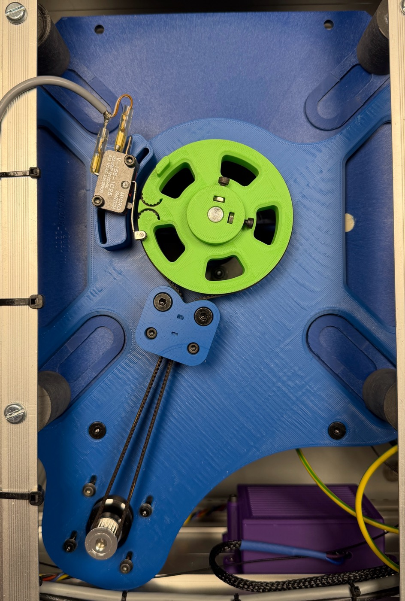

**Abb. 3** — Der Riementrieb auf der Antriebsplatte: unten links das Motorritzel,
in der Mitte die Spannrolleneinheit, oben die grosse Zahnscheibe auf der
Variac-Achse, links davon der Endschalter.

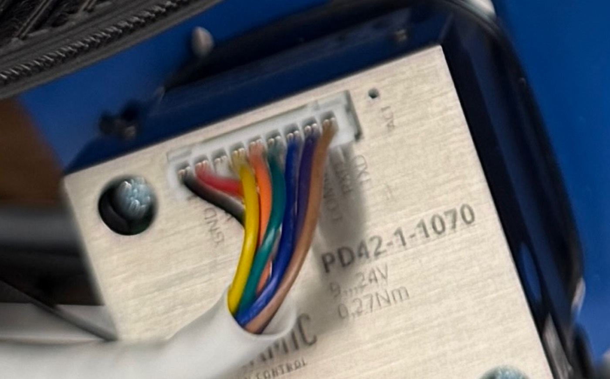

**Abb. 4** — Typenschild des Schrittmotors: `PD42-1-1070`, `9…24V`, `0,27Nm`.

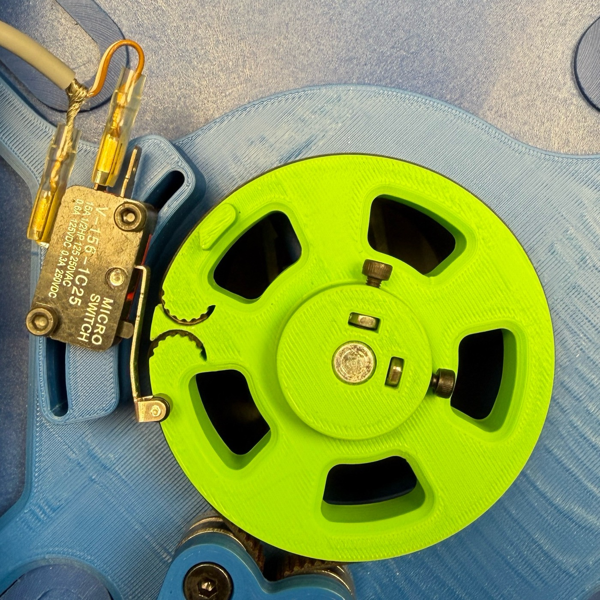

**Abb. 5** — Der Endschalter tastet die Nocke an der grossen Zahnscheibe ab.

---

## 3 AC-Voltmeter

Das AC-Voltmeter misst die Ausgangsspannung als echten Effektivwert und liefert
sie über eine serielle Verbindung an den Controller. Es ist die Rückführung für
die geschlossene Spannungsregelung — nicht zu verwechseln mit dem analogen
Dreheiseninstrument auf der Frontplatte (Kapitel 4, Position 6), das nur anzeigt.

| Menge | Baugruppe | Typ / Daten | Funktion |
|-------|-----------|-------------|----------|
| 1 | AC-Voltmeter-Print | *Trenntrafo_AC_Voltmeter*, rev. 1.0 · überwiegend SMD-Bestückung · [`PCB/Voltmeter/`](PCB/Voltmeter/) | Messung und serielle Übertragung |
| 1 | Gehäuse (3D-Druck) | [`CAD/AC_Voltmeter_Case v7.step`](CAD/) | Berührungsschutz, führt Netzspannung |

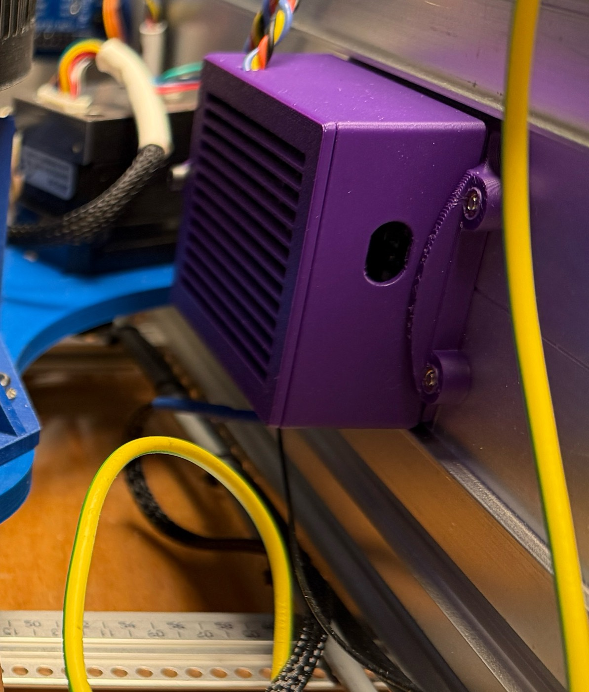

**Abb. 6** — Der AC-Voltmeter-Print sitzt in einem eigenen gedruckten Gehäuse mit
Lüftungsschlitzen.

---

## 4 Frontplattenelemente

Die Frontplatte trägt die gesamte Bedienung und Anzeige. Die Nummern in Abb. 7
entsprechen der Tabelle darunter.

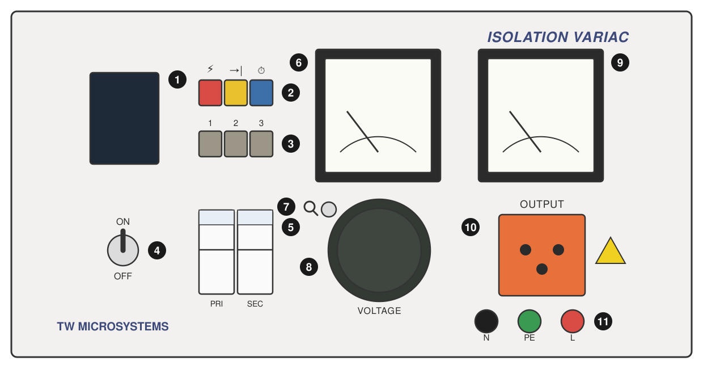

**Abb. 7** — Frontplatte, schematisch, mit den Positionsnummern der Tabelle.
Nicht massstäblich.

| Nr. | Menge | Bauteil | Typ / Daten | Funktion |
|-----|-------|---------|-------------|----------|
| 1 | 1 | TFT-Display 2,4" | **EastRising ER-TFTM024-3** · ILI9341 · 240 × 320 · SPI | zeigt Ist- und Sollspannung, Zustände, Menüs |
| 2 | 3 | Leuchttaster SPDT mit LED, farbig | **ITT Cannon DIGITAST** · rot, gelb, blau | Ausgang ein/aus, Strombegrenzung, Regelung |
| 3 | 3 | Leuchttaster SPDT mit LED, grau | **ITT Cannon DIGITAST** | Presets 1 bis 3 abrufen und speichern |
| 4 | 1 | Hauptschalter, 2-polig | Kippschalter für Frontmontage | trennt das Gerät allpolig vom Netz |
| 5 | 2 | Leitungsschutzschalter, 1-polig | **Hager MBN 006** · Charakteristik B · 6 A · 6000 A · Begrenzungsklasse 3 | `PRI` schützt den Primärkreis, `SEC` den Ausgang |
| 6 | 1 | Voltmeter, Dreheisen (analog) | **Sifam Tinsley Sigma Serie DE** · 72 × 72 mm · 0 … 250 V | zeigt die Spannung am Schleifer — unabhängig davon, ob der Ausgang ein- oder ausgeschaltet ist |
| 7 | 1 | LED-Melder Ø 6 mm | **APEM Q-Serie** · Gewinde M6 × 0,5 | zeigt die Schrittweite des Drehgebers: LED aus = x1, LED ein = x10. Auf der Front mit einem Lupensymbol gekennzeichnet |
| 8 | 1 | Drehgeber mit Taster und Knopf | **ALPS EC11B20244** (Bestellbezeichnung STEC11B13) | stellt die Sollspannung ein; der Taster schaltet die Schrittweite zwischen x1 und x10 um |
| 9 | 1 | Amperemeter, Dreheisen | **Sifam Tinsley Sigma Serie DE** · 72 × 72 mm · 0 … 5 A | zeigt den Ausgangsstrom |
| 10 | 1 | Ausgangssteckdose | Schweizer Typ 13, orange, Feller-Einsatz 250 V~ / 16 A | Ausgang des Geräts |
| 11 | 3 | Polklemme 4 mm | schwarz `N`, grün `PE`, rot `L` | Ausgang für Laborleitungen, parallel zur Steckdose (10) |

Hinter der Frontplatte montiert:

| Menge | Baugruppe | Typ / Daten | Funktion |
|-------|-----------|-------------|----------|
| 1 | Controller-Print | *Trennstelltrafo Controller*, 2020 rev. 2 · 134,6 × 69,2 mm · bedrahtete Bestückung · [`PCB/Controller/`](PCB/Controller/) | trägt die sechs Leuchttaster, treibt LEDs und Relais |
| 1 | ESP32-Print (Aufsteckmodul) | *Trenntrafo ESP32*, 2025 rev. 2 · SMD-Bestückung · [`PCB/ESP32Board/`](PCB/ESP32Board/) | Rechenkern, Regelung, Web-Oberfläche |

Die sechs Leuchttaster sind direkt auf den Controller-Print gelötet; Frontplatte
und Print bilden eine Einheit. Der ESP32-Print steckt auf dem Controller-Print und
ist einzeln nicht verwendbar.

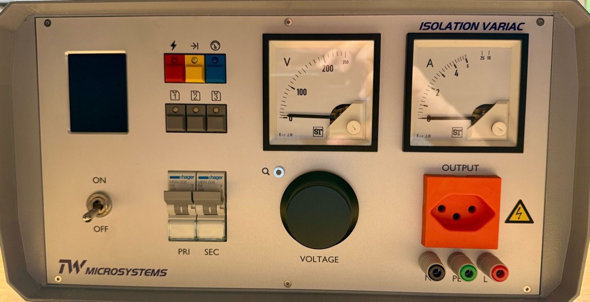

**Abb. 8** — Die Frontplatte im Original.

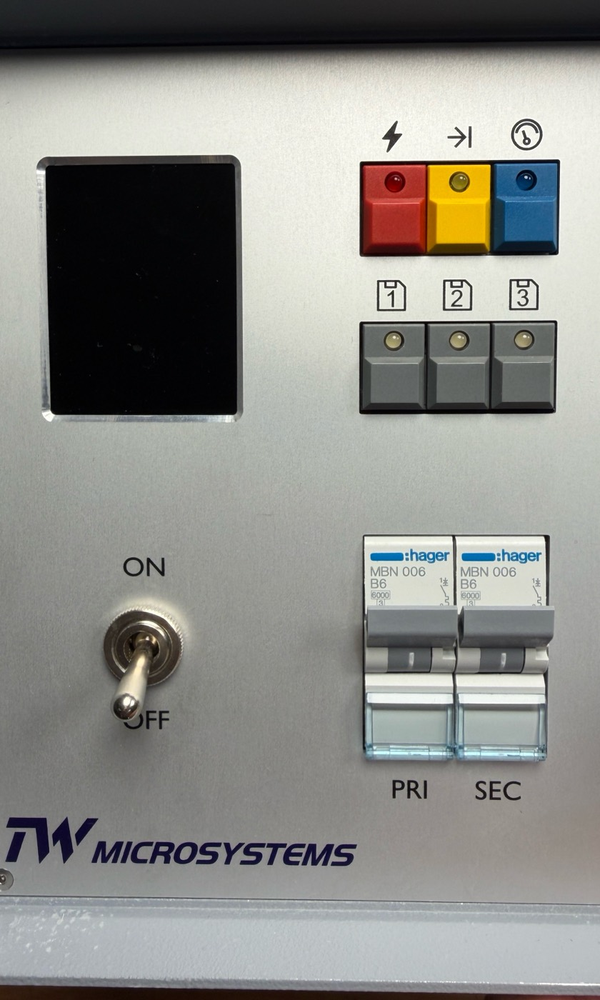

**Abb. 9** — Bedienteil: Display (1), farbige Leuchttaster (2), Preset-Taster (3),
Hauptschalter (4) und die beiden Leitungsschutzschalter (5).

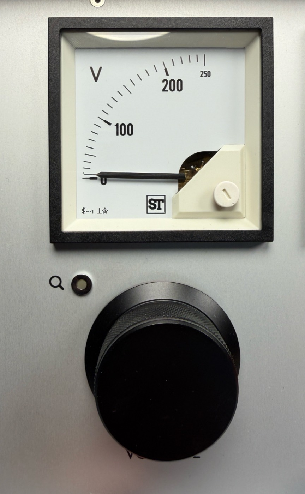

**Abb. 10** — Analoges Voltmeter (6) mit Nullpunktschraube, darunter der LED-Melder mit
Lupensymbol (7) und der Drehknopf des Drehgebers (8).

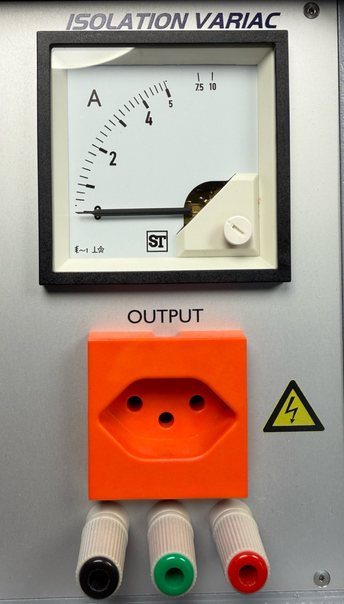

**Abb. 11** — Ausgangsbereich: Amperemeter (9), T13-Steckdose (10) und die drei
Polklemmen (11).

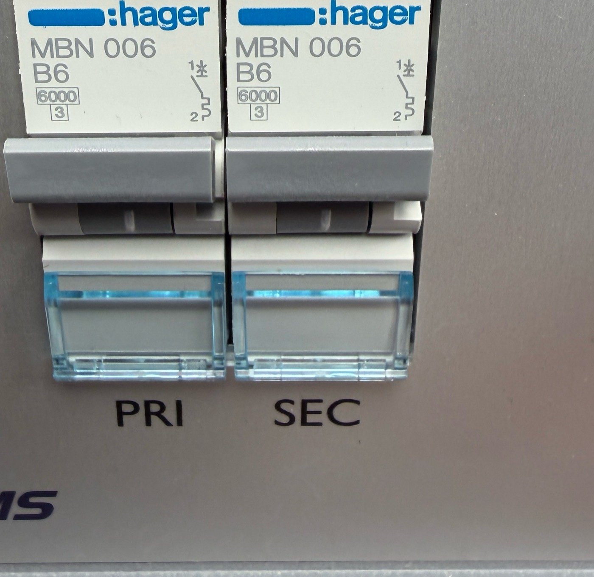

**Abb. 12** — Die beiden Leitungsschutzschalter (5): `MBN 006`, Charakteristik
`B6`, Schaltvermögen `6000` A, Begrenzungsklasse `3`.

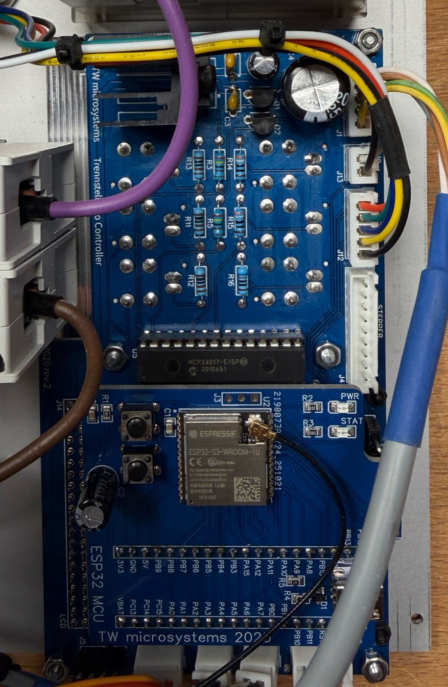

**Abb. 13** — Hinter der Frontplatte: oben der Controller-Print, unten das
aufgesteckte ESP32-Modul.

---

## 5 Rückplattenelemente

Die Rückplatte trägt die Stromversorgung, die Leistungsschaltung, die Kühlung und
die Anschlüsse nach aussen. Die Nummern in Abb. 13 entsprechen der Tabelle
darunter.

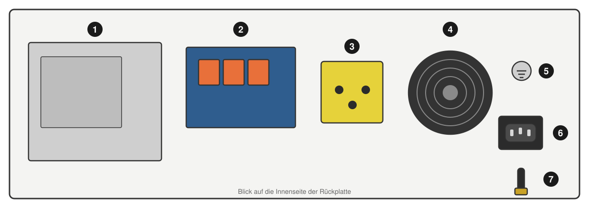

**Abb. 14** — Rückplatte, schematisch, von innen gesehen, mit den
Positionsnummern der Tabelle. Nicht massstäblich.

| Nr. | Menge | Bauteil | Typ / Daten | Funktion |
|-----|-------|---------|-------------|----------|
| 1 | 1 | Netzteil | **Mean Well LRS-75-24** · 100–240 V~ / 1,52 A · 24 V= / 3,2 A · ta 50 °C | Versorgung für Elektronik und Schrittmotor |
| 2 | 1 | Leistungsplatine | *Power-Board Trennstelltrafo*, 2020 rev. 1 · 3700 × 3150 mil · bedrahtete Bestückung · [`PCB/Power/`](PCB/Power/) | Relais für Ausgang, Strombegrenzung und Sanftanlauf |
| 3 | 1 | Steckdose Typ 13, gelb | Feller-Einsatz | Anschluss für die externe Strombegrenzung (Glühbirne) |
| 4 | 1 | Lüfter mit Drahtschutzgitter | Standard-4-Draht-Lüfter 12 V, ca. 92 mm | temperaturgeregelte Kühlung |
| 5 | 1 | Erdungspunkt | Schraubbolzen mit Klemme | Schutzleiter-Sammelpunkt des Gehäuses |
| 6 | 1 | Kaltgeräte-Einbaustecker | IEC C14 | Netzeinspeisung 230 V |
| 7 | 1 | WLAN-Antenne | Stabantenne auf Schraubbuchse, U.FL-Kabel zum ESP32-Modul | Funkverbindung für die Web-Oberfläche und die Geräte-API |

Der Lüfter ist ein Standard-4-Draht-Modell (GND, +12 V, Tacho, PWM). Der
Controller gibt nur das PWM-Signal aus; der Tacho-Ausgang wird nicht ausgewertet.
Für den Nachbau ist damit jeder gängige 92-mm-Lüfter mit 12 V und PWM-Eingang
brauchbar.

Die Strombegrenzung ist kein eingebautes Bauteil: In die gelbe Steckdose (3) wird
über ein Kabel eine Glühbirne gesteckt (Abb. 16), die bei eingeschalteter
Begrenzung in Reihe zum Ausgang liegt. Die Leistungsplatine überbrückt sie, wenn
die Begrenzung ausgeschaltet ist. Lampenfassung, Sockel und Kabel gehören zum
Zubehör des Geräts und sind in der Stückliste nicht enthalten.

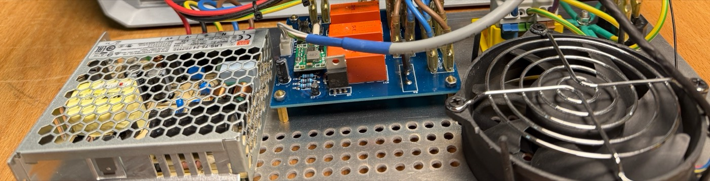

**Abb. 15** — Die ausgebaute Rückplatte von innen: Netzteil (1), Leistungsplatine
(2) und Lüfter (4); rechts hinter der Platine die gelbe Steckdose (3).

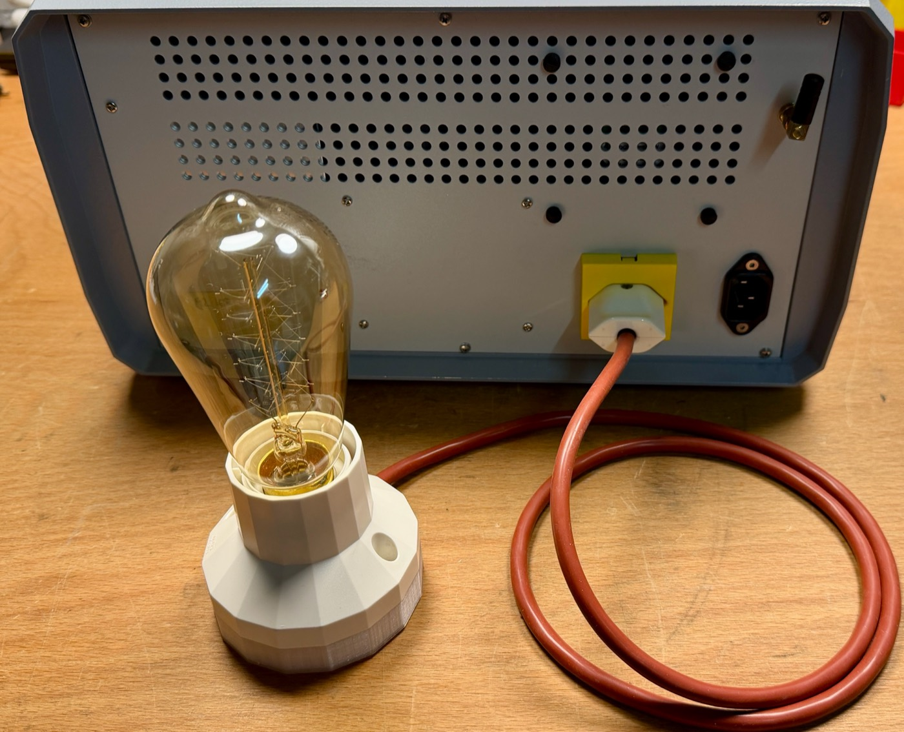

**Abb. 16** — Die Rückseite von aussen: über dem Lüftungsgitter des Lüfters (4)
die gelbe Steckdose (3) mit der angeschlossenen Glühbirne, rechts daneben der
Kaltgeräte-Einbaustecker (6) und oben die WLAN-Antenne (7).

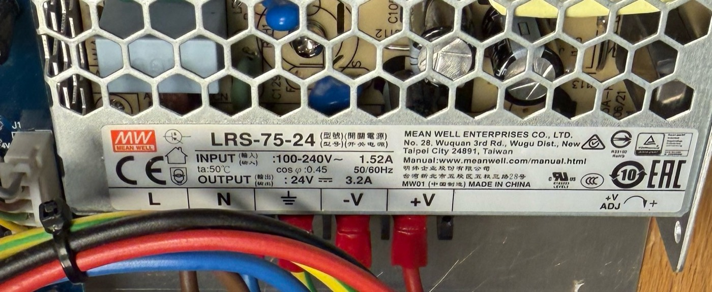

**Abb. 17** — Typenschild des Netzteils mit der Anschlussleiste
`L` · `N` · Erde · `-V` · `+V`.

---

## 6 Übriges

| Menge | Bauteil | Typ / Daten | Funktion |
|-------|---------|-------------|----------|
| 1 | Temperaturfühler 1-Wire | **Dallas DS18B20** | misst die Temperatur am Transformator, steuert den Lüfter |
| 1 | Tischgehäuse | **apra-norm apra line 280** · 4 HE / 63 TE / Tiefe 382 mm · belüftet in Rückwand und einer Schale · Bestell-Nr. **280-482** | Aufbau, Tragschienen im 10-mm-Raster |
| 1 | Frontplatte, Alu eloxiert, bedruckt | — | trägt die Bedienelemente |
| 1 | Variac-Träger (3D-Druck) | — | hält den Ringkern im Gehäuse |
| 1 | Antriebsplatte (3D-Druck) | — | trägt den Antrieb |

Das Gehäuse ist ein apra line 280 in 4 HE, 63 TE und 382 mm Tiefe, belüftet
(Datenblatt `Tischgehaeuse_Kat_14_Kap_6_S_163-173_apraline.pdf`). Die Aussenmasse
betragen rund 370 × 385 × 200 mm (Breite × Tiefe × Höhe mit Standfüssen).
Front- und Rückplatte sitzen in Rahmen, die Seitenteile tragen ein Lochraster im
10-mm-Raster — daran sind die Tragschienen im Gerät befestigt.

### Verdrahtungsmaterial

| Material | Daten |
|----------|-------|
| Litze für den 230-V-Kreis | 1 mm², Farben braun, blau, violett, gelb-grün |
| Flachsteckhülsen, isoliert | für die Lötfahnen der Leistungsplatine und die Frontelemente |
| Aderendhülsen | für die Reihenklemmen |
| Buchsengehäuse JST XH 2,50 mm mit Crimpkontakten | für die Steckverbinder des Controller-Prints |
| Reihen- und Trennklemmen, Sicherungssockel | für die Tragschiene |
| Kabelbinder, Gewebeschlauch, Zugentlastungen | — |

## Abbildungsverzeichnis

| Nr. | Titel | Datei |
|-----|-------|-------|
| Abb. 1 | Das geöffnete Gerät von oben | `Fotos/01-geraet-geoeffnet.jpg` |
| Abb. 2 | Schleiferwagen auf dem Ringkern | `Fotos/03-schleiferwagen.jpg` |
| Abb. 3 | Riementrieb von unten | `Fotos/14-riementrieb.jpg` |
| Abb. 4 | Typenschild des Schrittmotors | `Fotos/04-schrittmotor-typenschild.jpg` |
| Abb. 5 | Endschalter an der Zahnscheibe | `Fotos/13-endschalter-scheibe.jpg` |
| Abb. 6 | AC-Voltmeter im gedruckten Gehäuse | `Fotos/16-voltmeter-gehaeuse.jpg` |
| Abb. 7 | Frontplatte, schematisch | `Abbildungen/frontplatte-schema.svg` |
| Abb. 8 | Die Frontplatte im Original | `Fotos/19-frontplatte-gesamt.jpg` |
| Abb. 9 | Bedienteil der Frontplatte | `Fotos/05-frontplatte.jpg` |
| Abb. 10 | Analoges Voltmeter und Drehgeber | `Fotos/07-instrument-voltmeter.jpg` |
| Abb. 11 | Ausgangsbereich der Frontplatte | `Fotos/08-ausgang.jpg` |
| Abb. 12 | Leitungsschutzschalter PRI und SEC | `Fotos/06-hager-mbn006.jpg` |
| Abb. 13 | Controller-Print mit ESP32-Modul | `Fotos/12-controller-print.jpg` |
| Abb. 14 | Rückplatte, schematisch | `Abbildungen/rueckplatte-schema.svg` |
| Abb. 15 | Rückplatte, bestückt | `Fotos/18-rueckplatte.jpg` |
| Abb. 16 | Rückseite mit angeschlossener Strombegrenzung | `Fotos/20-strombegrenzung.jpg` |
| Abb. 17 | Typenschild des Netzteils | `Fotos/09-netzteil-lrs75.jpg` |
