# Verdrahtung — TWM Isolation Variac

*Ohne Gewähr — diese Unterlagen beschreiben ein selbstgebautes Gerät am
230-V-Netz. Wer danach baut oder misst, tut das auf eigene Verantwortung.
Siehe [Haftungsausschluss](../README.md#haftungsausschluss).*

Dieses Dokument beschreibt, wie die Baugruppen des Geräts untereinander verbunden
sind. Die Baugruppen selbst und ihre Daten stehen in
[`Stueckliste.md`](Stueckliste.md), Schemas, Layouts und Gerber der vier Prints in
[`PCB/`](PCB/).

> **Der Sekundärkreis ist netzgetrennt.** Ein FI im Hausnetz löst dort nicht aus,
> und zwischen beiden Ausgangspolen und Erde besteht kein definiertes Potential.
> Beide Pole führen bis 253 V gegeneinander.

Die Gliederung folgt dem Gerät: zuerst die Rückplatte, dann die Frontplatte, dann
was dazwischen liegt.

**Zwei Detailtiefen.** Auf der **230-V-Seite** ist jede Litze einzeln aufgeführt,
mit Anfang, Ende, Aderfarbe und Querschnitt. Bei den **Niedervolt-Verbindungen**
stehen nur Steckerbezeichnung, Polzahl, Gegenstelle und Funktion — die
Pinbelegung steht im Schema des jeweiligen Prints in [`PCB/`](PCB/), die Daten der
Gegenstelle im Datenblatt.

Die Adern im 230-V-Kreis sind **1 mm²**; einzige Ausnahme sind die beiden
Messleitungen des AC-Voltmeters mit **0,25 mm²**. Es gibt genau vier Aderfarben,
und sie gelten für jeden Querschnitt:

| Farbe | Verwendung |
|-------|------------|
| braun | Polleiter der Primärseite — vom Kaltgerätestecker über den Hauptschalter und `PRI` bis zur Primärklemme `230` des Transformators |
| blau | alle Neutralleiter |
| violett | alle Schleiferleiter, also die Polleiter der Sekundärseite |
| gelb-grün | alle Schutzleiter |

Andere Farben kommen im 230-V-Kreis nicht vor.

---

## Übersicht: der 230-V-Pfad

Die Stationsnummern in Abb. 1 kommen in den Tabellen der folgenden Kapitel wieder
vor.

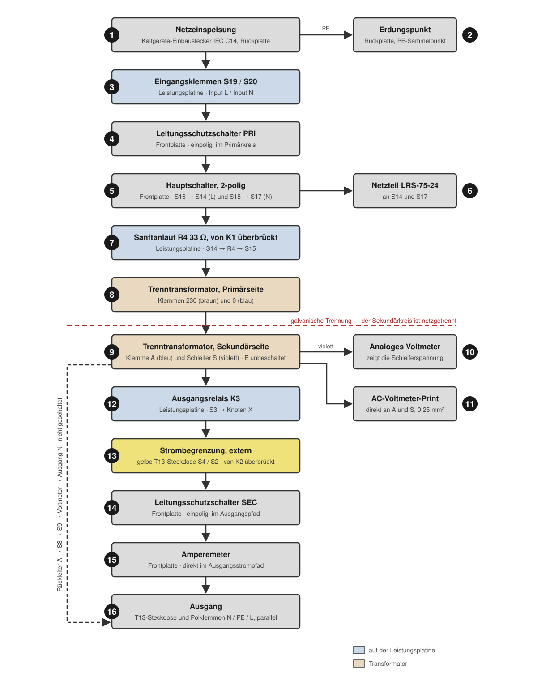

**Abb. 1** — Der 230-V-Pfad vom Netzanschluss bis zum Ausgang, mit den
Stationsnummern der Tabellen. Kein Stromlaufplan, nicht massstäblich.

Fünf Eigenheiten dieses Pfads bestimmen die Verdrahtung:

**Die beiden Leitungsschutzschalter sind einpolig und liegen an verschiedenen
Stellen.** `PRI` (Station 4) sitzt im Primärkreis zwischen den Eingangsklemmen und
dem Hauptschalter, `SEC` (Station 14) im Ausgangspfad zwischen der
Strombegrenzung und dem Amperemeter.

**Der Hauptschalter trennt zweipolig** (Station 5). Die vier `Power Switch`-Fahnen
der Leistungsplatine sind zwei Paare: `S16` → `PRI` → Schalter → `S14` führt L,
`S18` → Schalter → `S17` führt N.

**Der Sanftanlauf liegt im L-Zweig der Primärseite** (Station 7). `R4` mit 33 Ω
begrenzt den Einschaltstrom, `K1` (*SOFT*) überbrückt ihn, sobald das Zeitglied
auf der Leistungsplatine durchgeschaltet hat. `K1` hat keine Steuerleitung vom
Controller.

**Die Strombegrenzung ist ausfallsicher herum gebaut** (Station 13). `K2`
überbrückt das Begrenzungselement, und die Firmware treibt dieses Relais
invertiert. Relais **abgefallen** = Element in Reihe = **Begrenzung aktiv**. Ohne
Steuerspannung ist die Begrenzung eingeschaltet.

**Der Rückleiter des Ausgangs wird nicht geschaltet.** `K3` (Station 12) liegt nur
im Schleiferzweig. Die Klemme `A` des Transformators führt über `S8` → `S9` auf
die untere Klemme des analogen Voltmeters und von dort weiter zum Ausgang. Bei
ausgeschaltetem Ausgang ist dieser Pol weiterhin mit der Sekundärwicklung
verbunden.

---

## 1 Rückplatte

Auf der Rückplatte sitzen Netzteil, Leistungsplatine, die gelbe Steckdose für die
externe Strombegrenzung, der Lüfter, der Erdungspunkt, der Kaltgerätestecker und
die WLAN-Antenne.

**Abb. 2** — Die ausgebaute Rückplatte von innen: links das Netzteil, daneben die
Leistungsplatine mit den drei Relais, rechts der Lüfter; hinter der Platine die
gelbe Steckdose.

### 1.1 230-V-Verbindungen

| Station | Von | Nach | Ader | Querschnitt |
|---------|-----|------|------|-------------|
| 1 → 3 | Kaltgerätestecker IEC C14, `L` | Leistungsplatine `S19` · `Input L` | braun | 1 mm² |
| 1 → 3 | Kaltgerätestecker IEC C14, `N` | Leistungsplatine `S20` · `Input N` | blau | 1 mm² |
| 3 → 4 | Leistungsplatine `S16` · `Power Switch` | Leitungsschutzschalter `PRI`, Frontplatte | braun | 1 mm² |
| 5 → 7 | Hauptschalter Pol 1, Frontplatte | Leistungsplatine `S14` · `Power Switch` | braun | 1 mm² |
| 3 → 5 | Leistungsplatine `S18` · `Power Switch` | Hauptschalter Pol 2, Frontplatte | blau | 1 mm² |
| 5 | Hauptschalter Pol 2, Frontplatte | Leistungsplatine `S17` · `Power Switch` | blau | 1 mm² |
| 7 → 8 | Leistungsplatine `S15` · `Transformer 230` | Transformator, Klemme `230` | braun | 1 mm² |
| 8 | Leistungsplatine `S21` · `Transformer 0` | Transformator, Klemme `0` | blau | 1 mm² |
| 9 → 12 | Leistungsplatine `S3` · `Transformer S` | Transformator, Schleifer `S` | violett | 1 mm² |
| 9 | Leistungsplatine `S8` · `Transformer A` | Transformator, Klemme `A` | blau | 1 mm² |
| 13 | Leistungsplatine `S4` · `Limit N` | gelbe T13-Steckdose | violett | 1 mm² |
| 13 | Leistungsplatine `S2` · `Limit L` | gelbe T13-Steckdose | violett | 1 mm² |
| 13 → 14 | Leistungsplatine `S7` · `Out L` | Leitungsschutzschalter `SEC`, Frontplatte | violett | 1 mm² |
| 10 | Leistungsplatine `S9` · `Out N` | Analoges Voltmeter, untere Klemme, Frontplatte | blau | 1 mm² |
| 5 → 6 | Leistungsplatine `S22` (modifiziert) | Netzteil LRS-75-24, `L` | braun | 1 mm² |
| 5 → 6 | Leistungsplatine `S23` (modifiziert) | Netzteil LRS-75-24, `N` | blau | 1 mm² |

Drei Verbindungen liegen **innerhalb** der Leistungsplatine und brauchen keine
Litze: `S19` ist mit `S16` verbunden, `S20` mit `S18` und `S2` mit `S7`.

**Die Leistungsplatine ist modifiziert.** Die beiden Fahnen `S22` und `S23`
trugen ursprünglich `PE` und `PE Case`. Sie sind vom Schutzleiter getrennt und
auf `L` und `N` gelegt; daran hängt das Netzteil — `S22` führt `L`, `S23` führt
`N`. Die beiden Brücken greifen hinter
dem Hauptschalter ab (`S14` und `S17`), das Netzteil schaltet also mit dem
Hauptschalter ein. Der Umbau ist in
[`Modifikation-Leistungsplatine.md`](Modifikation-Leistungsplatine.md)
beschrieben.

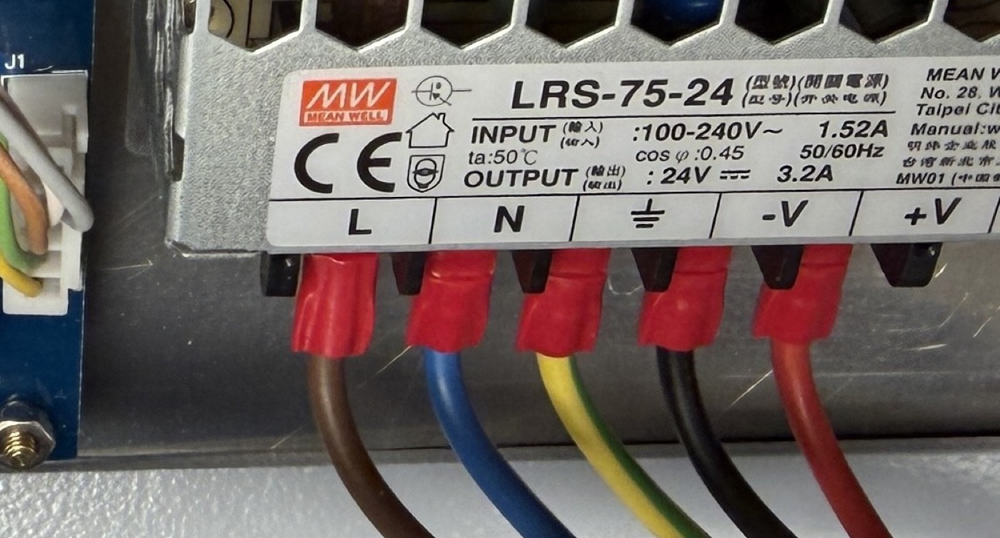

**Abb. 3** — Die Anschlussleiste des Netzteils: `L` braun, `N` blau, Erde
gelb-grün, `−V` schwarz, `+V` rot. Alle Anschlüsse mit isolierten
Flachsteckhülsen.

### 1.2 Schutzleiter

Alle Schutzleiter laufen auf dem Erdungsbolzen der Rückwand (Station 2) zusammen.
Je eine eigene Ader, alle gelb-grün, 1 mm².

| Von | Nach |
|-----|------|
| Kaltgerätestecker IEC C14, `PE` | Erdungsbolzen Rückwand |
| gelbe T13-Steckdose (Strombegrenzung), `PE` | Erdungsbolzen Rückwand |
| Gehäuseboden | Erdungsbolzen Rückwand |
| Gehäusedeckel | Erdungsbolzen Rückwand |
| Netzteil LRS-75-24, `⏚` | Erdungsbolzen Rückwand |
| Frontplatte | Erdungsbolzen Rückwand |
| PE-Anschlüsse der Frontplatte (Ausgangssteckdose und Polklemme `PE`) | Erdungsbolzen Rückwand |

Die Leistungsplatine hat seit der Modifikation keinen Schutzleiteranschluss mehr.

### 1.3 Strombegrenzung

Die gelbe T13-Steckdose ist der Anschluss für die externe Strombegrenzung. Ohne
eingestecktes Begrenzungselement ist der Ausgang nur bei überbrückter Steckdose
(`K2` angezogen) durchgängig.

**Abb. 4** — Die Rückseite von aussen: die gelbe Steckdose mit der angesteckten
Glühbirne, rechts daneben der Kaltgeräte-Einbaustecker und oben die WLAN-Antenne.

### 1.4 Klemmen der Leistungsplatine

`S…` sind die Flachsteckanschlüsse. Die Nummern stehen im Schema, die
Klartextbeschriftung daneben auf dem Print — beim Arbeiten am Gerät ist die
Beschriftung auf dem Print die bequemere Orientierung.

| Anschluss | Beschriftung auf dem Print | Netzname im Schema | Führt zu |
|-----------|---------------------------|--------------------|----------|
| `S19` | `Input L` | L | Kaltgerätestecker `L`; intern mit `S16` |
| `S20` | `Input N` | N | Kaltgerätestecker `N`; intern mit `S18` |
| `S16` | `Power Switch` | SWITCH_230V | Leitungsschutzschalter `PRI` |
| `S14` | `Power Switch` | SWITCH_230V | Hauptschalter, Pol 1 zurück |
| `S18` | `Power Switch` | SWITCH_0V | Hauptschalter, Pol 2 hin |
| `S17` | `Power Switch` | SWITCH_0V | Hauptschalter, Pol 2 zurück |
| `S15` | `Transformer 230` | 230V | Transformator `230` |
| `S21` | `Transformer 0` | 0V | Transformator `0` |
| `S3` | `Transformer S` | S VAR | Transformator, Schleifer `S` |
| `S8` | `Transformer A` | A | Transformator `A` |
| `S4` | `Limit N` | L_CURRENT_LIMIT | gelbe T13-Steckdose |
| `S2` | `Limit L` | N_CURRENT_LIMIT | gelbe T13-Steckdose; intern mit `S7` |
| `S7` | `Out L` | L_ISOL | Leitungsschutzschalter `SEC` |
| `S9` | `Out N` | N_ISOL | Analoges Voltmeter, untere Klemme |
| `S12` | `24V +` | 24V+ | Netzteil `+V` |
| `S13` | `24V −` | 24V GND | Netzteil `−V` |
| `S22` | `PE` | PE | **modifiziert:** Netzteil `L` |
| `S23` | `PE` | PE Case | **modifiziert:** Netzteil `N` |

> **Zu `Limit`:** Auf dem Print steht `L` über `S2` und `N` über `S4`, im Schema
> heissen die Netze umgekehrt (`N_CURRENT_LIMIT` an `S2`, `L_CURRENT_LIMIT` an
> `S4`). Es gilt der Print: `S2` liegt am Ausgang `L`. Für den Anschluss der
> Steckdose spielt es keine Rolle, das Begrenzungselement hat keine
> Vorzugsrichtung.

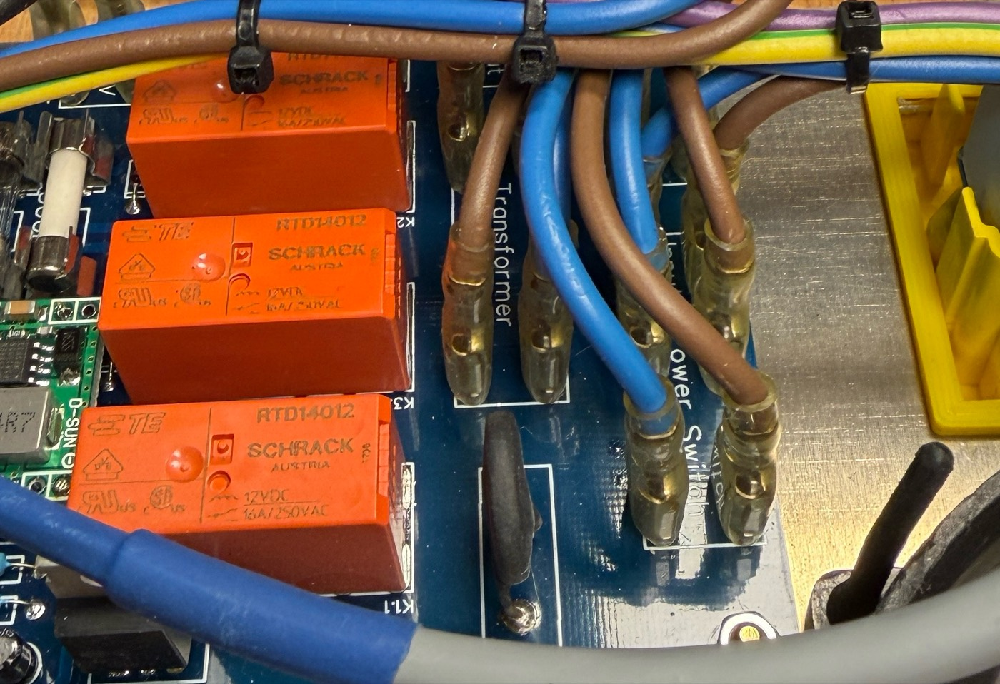

**Abb. 5** — Die drei Relais und rechts daneben die Flachsteckanschlüsse.

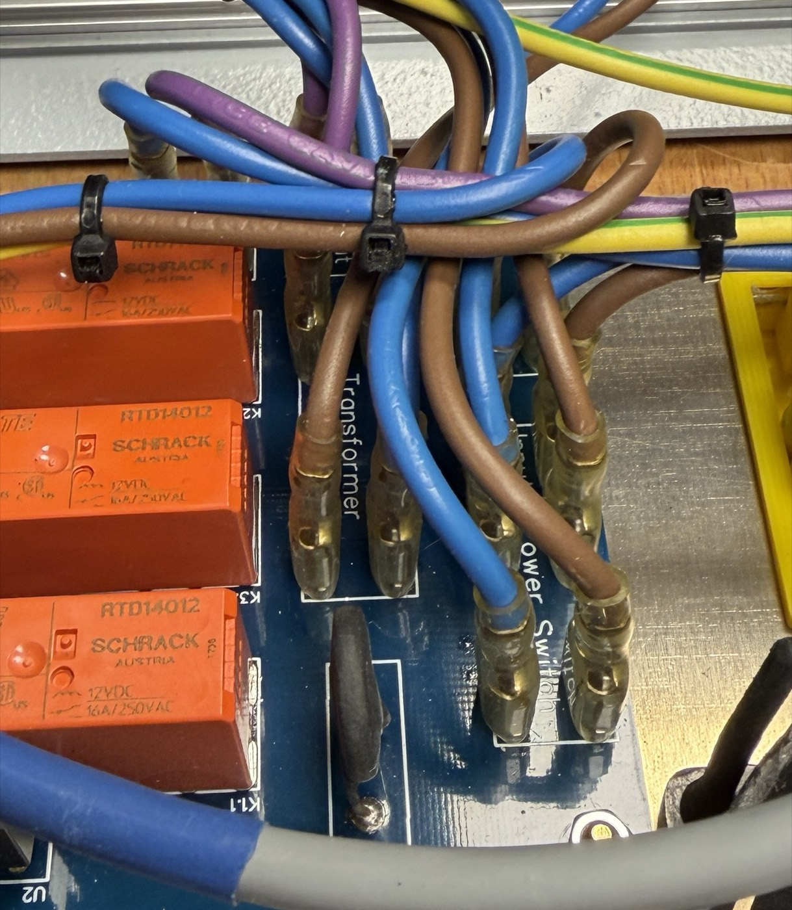

**Abb. 6** — Die beiden Fahnenreihen im Detail, mit dem Aufdruck `Transformer`
(links) und `Power Switch` (rechts). Alle Litzen sind mit isolierten
Flachsteckhülsen aufgesteckt.

### 1.5 Niedervolt-Verbindungen

| Verbindung | Pole | Gegenstelle | Funktion |
|------------|------|-------------|----------|
| `S12` / `S13` · `24V +` / `24V −` | 2 | Netzteil Mean Well LRS-75-24, `+V` / `−V` | Versorgung der Leistungsplatine |
| `J1` CONTROLLER | 5 | Controller-Print `J1` POWER | Versorgung und Ansteuerung der beiden Relais |
| Lüfter | 4 | Controller-Print `J5` FAN | Versorgung und Drehzahlvorgabe |
| WLAN-Antenne | 1 | ESP32-Print, U.FL-Buchse | Antennenanschluss |

Die Spulen von `K2` und `K3` liegen dauerhaft an +12 V; der Controller zieht die
kalte Seite über `J1` nach Masse.

---

## 2 Frontplatte

Die Frontplatte trägt die Bedienung, die beiden Analoginstrumente, den
Hauptschalter, die beiden Leitungsschutzschalter und den Ausgang. Hinter ihr
sitzen der Controller-Print mit dem aufgesteckten ESP32-Modul und eine
Tragschiene mit den beiden Leitungsschutzschaltern.

**Abb. 7** — Die Frontplatte: links Display und Hauptschalter, daneben die Taster
mit den Leitungsschutzschaltern, dann das analoge Voltmeter mit dem Drehknopf und
rechts das Amperemeter mit der Ausgangssteckdose und den Polklemmen.

### 2.1 230-V-Verbindungen

Verbindungen von und zur Rückplatte stehen in Abschnitt 1.1, die Zuleitung vom
Schleifer zum analogen Voltmeter in Abschnitt 3.1 und die Schutzleiter in
Abschnitt 1.2. Hier stehen die Verbindungen innerhalb der Frontplatte.

| Station | Von | Nach | Ader | Querschnitt |
|---------|-----|------|------|-------------|
| 4 → 5 | Leitungsschutzschalter `PRI` | Hauptschalter, Pol 1 | braun | 1 mm² |
| 10 → 16 | Analoges Voltmeter, untere Klemme | T13-Ausgangssteckdose, `N` | blau | 1 mm² |
| 14 → 15 | Leitungsschutzschalter `SEC` | Amperemeter | violett | 1 mm² |
| 15 → 16 | Amperemeter | T13-Ausgangssteckdose, `L` | violett | 1 mm² |
| 16 | T13-Ausgangssteckdose, `L` | Polklemme `L` (rot) | violett | 1 mm² |
| 16 | T13-Ausgangssteckdose, `N` | Polklemme `N` (schwarz) | blau | 1 mm² |

Am Hauptschalter liegen vier Litzen, je zwei pro Pol. Er trennt das Gerät
allpolig; vor ihm stehen nur die Eingangsklemmen der Leistungsplatine und der
Leitungsschutzschalter `PRI` unter Spannung.

Die beiden Leitungsschutzschalter sitzen auf einer Tragschiene unmittelbar hinter
der Frontplatte, die Kappen tragen die Beschriftung `P` und `S`.

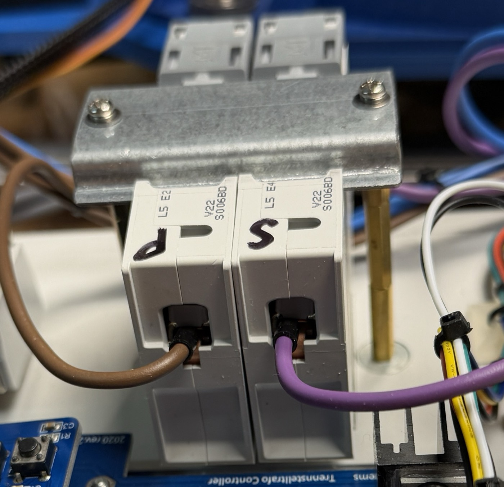

**Abb. 8** — Die beiden Leitungsschutzschalter von hinten, mit den Kappen `P`
(Primär) und `S` (Sekundär). Am Anschluss von `P` liegt eine braune Ader, an `S`
eine violette.

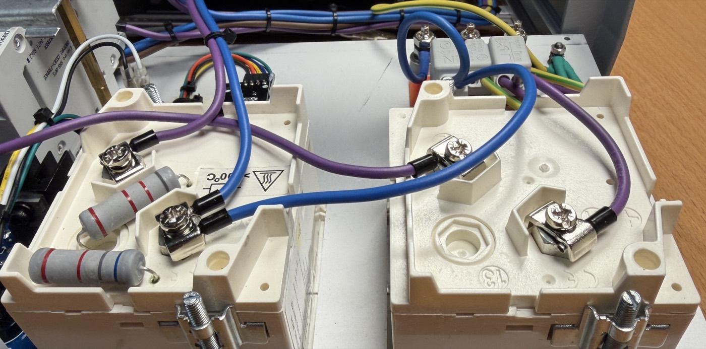

**Abb. 9** — Die Anschlüsse der beiden Analoginstrumente von hinten. Links das
Voltmeter mit seinen zwei Vorwiderständen und der Kennzeichnung „> 100 °C" —
die Zuleitungen müssen wärmebeständig sein. Rechts das Amperemeter mit zwei
violetten Adern. Der blaue Bogen darüber gehört nicht zum Amperemeter, er führt
vom Voltmeter zur Ausgangssteckdose.

**Das analoge Voltmeter liegt zugleich im Rückleiter des Ausgangs.** Seine obere
Klemme hängt über die Vorwiderstände am Schleifer `S` des Transformators, seine
untere Klemme trägt **zwei** blaue Adern: die eine kommt von `S9` · `Out N` der
Leistungsplatine, die andere geht weiter zur Ausgangssteckdose. Das Instrument
zeigt damit die Spannung am Schleifer an, unabhängig davon, ob der Ausgang
eingeschaltet ist.

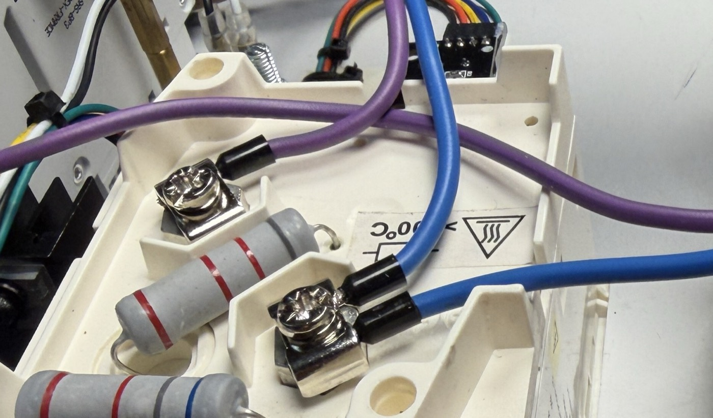

**Abb. 10** — Die Klemmen des analogen Voltmeters: oben eine violette Ader über
die beiden Vorwiderstände, unten die zwei blauen Adern des Rückleiters auf
derselben Klemme.

Das Amperemeter liegt mit 5 A direkt im Ausgangsstrompfad, ohne Shunt und ohne
Wandler.

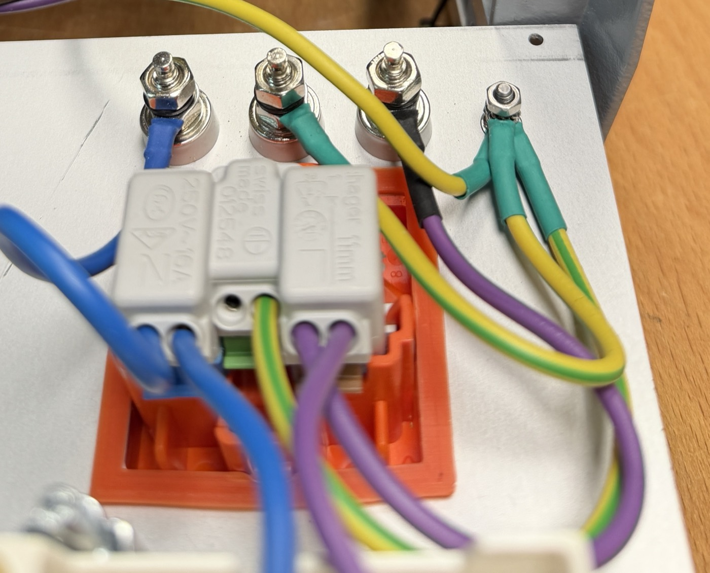

**Abb. 11** — Der Ausgang von hinten: auf den Klemmen der T13-Steckdose sitzt
eine dreipolige Steckklemme, von der die Polklemmen darüber abgehen. Steckdose
und Polklemmen liegen parallel.

### 2.2 Niedervolt-Verbindungen

Der Controller-Print ist der Verteiler hinter der Frontplatte. Die Pinbelegung
der Stecker steht im Schema in [`PCB/Controller/`](PCB/Controller/).

| Stecker | Pole | Gegenstelle | Funktion |
|---------|------|-------------|----------|
| `J1` POWER | 5 | Leistungsplatine `J1` | Versorgung und Ansteuerung der beiden Relais |
| `J4` STEPPER | 9 | Trinamic PD42-1-1070 | Versorgung und Ansteuerung des Schrittmotors |
| `J12` ENCODER | 5 | Drehgeber ALPS EC11 | Sollwert und Schrittweite |
| `J14` LCD | 40 | TFT-Display ER-TFTM024-3 | Anzeige |
| `J13` 10x LED | 2 | LED-Melder mit Lupensymbol | Meldet die Schrittweite x10 |
| `J6` UART | 4 | AC-Voltmeter-Print `J1` HOST | Messwerte vom AC-Voltmeter |
| `J2` 1WIRE | 3 | Temperaturfühler Dallas DS18B20 | Temperatur am Transformator |
| `J5` FAN | 4 | Lüfter Rückplatte | Versorgung und Drehzahlvorgabe |
| `J9` SWITCH 0V | 2 | Endschalter am Antrieb | Referenzpunkt des Schleifers |
| `J11` SWITCH 250V | 2 | nicht belegt | vorgesehen für einen zweiten Endschalter |
| `J8` FTDI | 6 | nicht belegt | Servicezugang |

Die Steckverbinder `J1`, `J2`, `J4`, `J6`, `J9`, `J11`, `J12` und `J13` sind
**JST XH mit 2,50 mm Raster**, Gegenstück Buchsengehäuse `XHP-<n>` mit
Crimpkontakten `SXH-001T-P0.6`. `J5` und `J8` sind Buchsenleisten mit 2,54 mm,
`J14` eine Stiftleiste 20 × 2. Massgebend ist die BOM des Prints — `J13` etwa
heisst im Schema „JST-PH2", ist aber als XH gelayoutet.

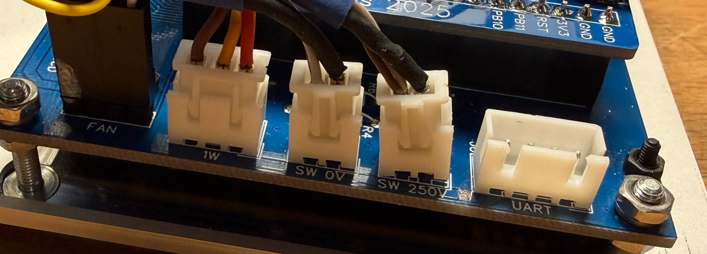

**Abb. 12** — Die Beschriftung am Printrand: `FAN`, `1W`, `SW 0V`, `SW 250V`,
`UART`.

**Der Controller-Print ist modifiziert:** `J6` Pin 4 führt 12 V statt 3,3 V, damit
das AC-Voltmeter über denselben Stecker gespeist wird. Beschrieben in
[`Modifikation-Controller-Print.md`](Modifikation-Controller-Print.md).

Die sechs Leuchttaster sind direkt auf den Controller-Print gelötet — sie
brauchen keine Verdrahtung. Beim Bestücken auf die Designatoren achten, nicht auf
die Reihenfolge: **`S5` ist Preset 3, `S6` ist Preset 2.**

Das ESP32-Modul steckt auf dem Bluepill-Fussabdruck `U3` des Controller-Prints.
Eigene Anschlüsse nach aussen hat es zwei: die U.FL-Buchse für die WLAN-Antenne
und den Mini-USB-B für Flash und serielle Konsole.

---

## 3 Dazwischen

### 3.1 Transformator

| Klemme | Ader | Querschnitt | Führt zu | Station |
|--------|------|-------------|----------|---------|
| `230` | braun | 1 mm² | Leistungsplatine `S15` · `Transformer 230` | 8 |
| `0` | blau | 1 mm² | Leistungsplatine `S21` · `Transformer 0` | 8 |
| `A` | blau | 1 mm² | Leistungsplatine `S8` · `Transformer A` | 9 |
| `A` | blau | 0,25 mm² | AC-Voltmeter-Print `J2` AC Input | 11 |
| `S` | violett | 1 mm² | Leistungsplatine `S3` · `Transformer S` | 9 |
| `S` | violett | 1 mm² | Analoges Voltmeter, obere Klemme, Frontplatte | 10 |
| `S` | violett | 0,25 mm² | AC-Voltmeter-Print `J2` AC Input | 11 |
| `E` | — | — | unbeschaltet | — |

An der Klemme `A` liegen damit **zwei**, am Schleifer `S` **drei** Leiter.

Der Ausgang liegt zwischen `A` und `S` und deckt die ganze Wicklung von `A` bis
`E` ab: < 1 … 253 V bei 230 V am Eingang, proportional mehr bei höherer
Netzspannung. `E` bleibt unbeschaltet.

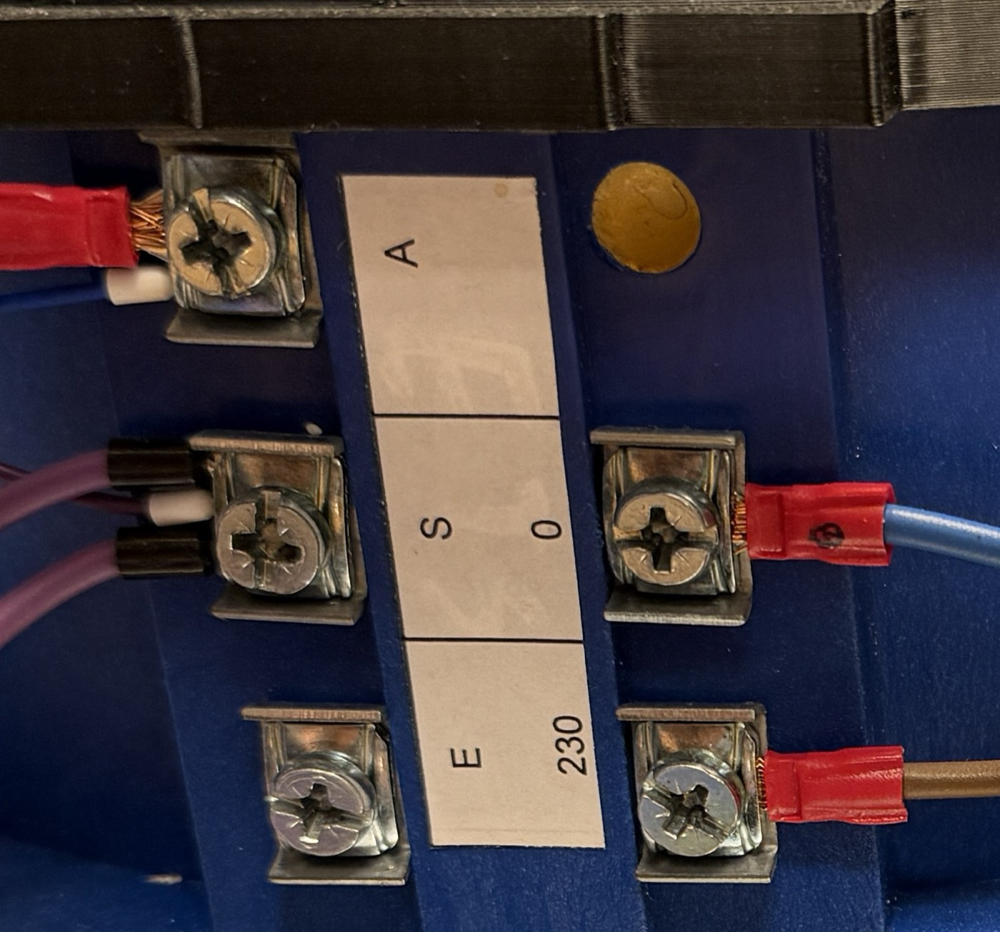

**Abb. 13** — Die Klemmenplatte des Transformators. Die Beschriftung liegt quer:
links oben `A`, darunter `S`, unten links `E` ohne Anschluss; rechts `0` und
`230`.

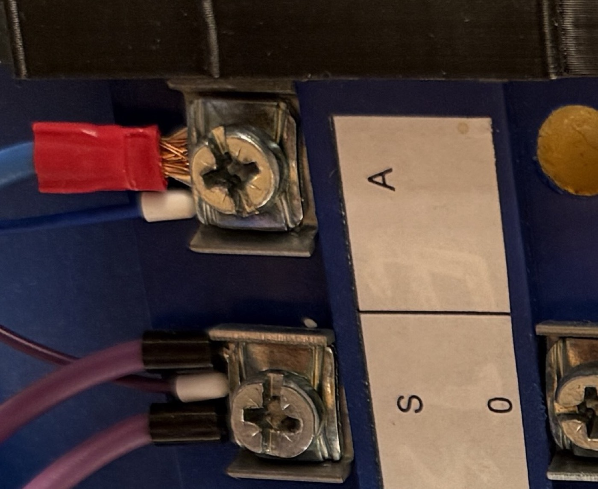

**Abb. 14** — Die Klemmen `A` (oben) und `S` (unten) im Detail: an `A` die blaue
1-mm²-Ader und daneben der Anschluss der dünnen Messader, an `S` die zwei
violetten 1-mm²-Adern und dazwischen die zweite Messader.

### 3.2 Antrieb

Der Antrieb führt keine Netzspannung.

| Verbindung | Pole | Gegenstelle | Funktion |
|------------|------|-------------|----------|
| Schrittmotor Trinamic PD42-1-1070 | 9 | Controller-Print `J4` STEPPER | Versorgung und Ansteuerung des Schrittmotors |
| Endschalter | 2 | Controller-Print `J9` SWITCH 0V | Referenzpunkt des Schleifers |

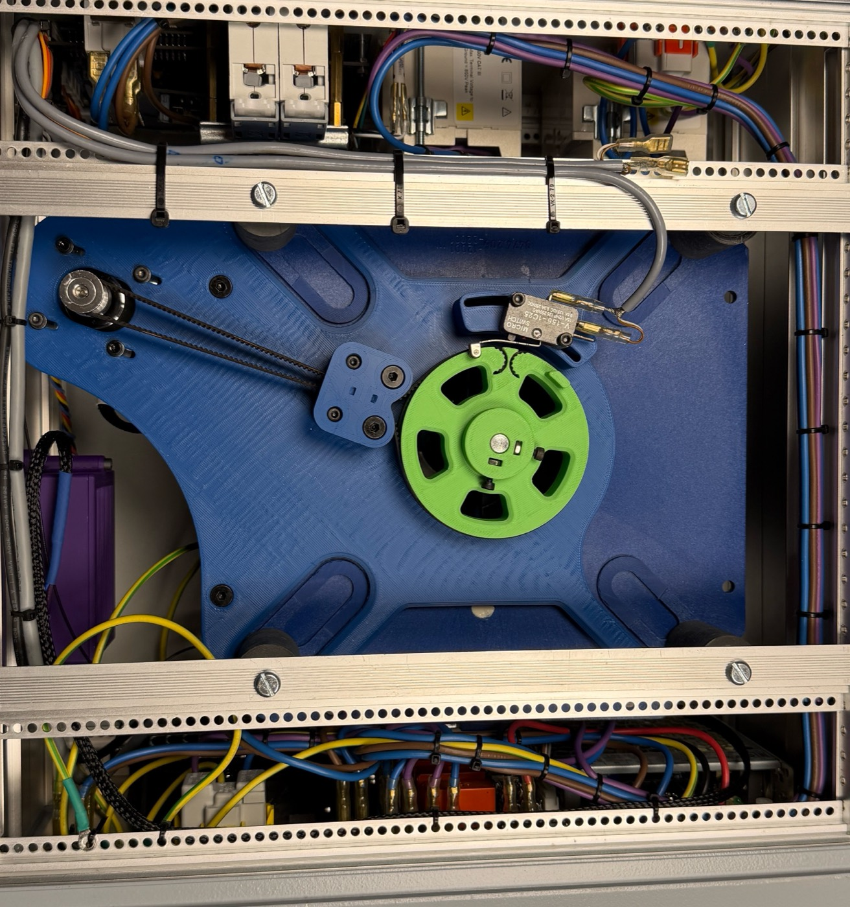

**Abb. 15** — Das Gerät von unten: oben die Tragschiene mit den
Leitungsschutzschaltern von hinten, in der Mitte die Antriebsplatte mit Motor und
Endschalter, unten die Leistungsplatine mit ihren Flachsteckanschlüssen.

### 3.3 AC-Voltmeter

Der AC-Voltmeter-Print sitzt in einem eigenen gedruckten Gehäuse. Sein
Messeingang hängt direkt an der Sekundärwicklung und führt Netzspannung.

230 V:

| Station | Von | Nach | Ader | Querschnitt |
|---------|-----|------|------|-------------|
| 9 → 11 | Transformator, Klemme `A` | AC-Voltmeter `J2` AC Input | blau | 0,25 mm² |
| 9 → 11 | Transformator, Schleifer `S` | AC-Voltmeter `J2` AC Input | violett | 0,25 mm² |

Das AC-Voltmeter misst damit dieselbe Spannung wie das analoge Instrument — die
Spannung am Schleifer, unabhängig vom Zustand des Ausgangsrelais.

Niedervolt:

| Stecker | Pole | Gegenstelle | Funktion |
|---------|------|-------------|----------|
| `J1` HOST | 4 | Controller-Print `J6` UART | Versorgung und Übertragung der Messwerte |

**Der AC-Voltmeter-Print ist modifiziert:** der Link zum Controller liegt auf
USART1 statt USART2 und ist bidirektional. Beschrieben in
[`Modifikation-AC-Voltmeter-Print.md`](Modifikation-AC-Voltmeter-Print.md).

---

## Abbildungsverzeichnis

| Nr. | Titel | Datei |
|-----|-------|-------|
| Abb. 1 | Der 230-V-Pfad, schematisch | `Abbildungen/leistungspfad-schema.svg` |
| Abb. 2 | Rückplatte von innen | `Fotos/18-rueckplatte.jpg` |
| Abb. 3 | Anschlussleiste des Netzteils | `Fotos/22-netzteil-anschluss.jpg` |
| Abb. 4 | Rückseite mit angeschlossener Strombegrenzung | `Fotos/20-strombegrenzung.jpg` |
| Abb. 5 | Leistungsplatine mit Relais und Flachsteckanschlüssen | `Fotos/10-power-print-relais.jpg` |
| Abb. 6 | Fahnenreihen der Leistungsplatine | `Fotos/23-leistungsplatine-fahnen.jpg` |
| Abb. 7 | Die ganze Frontplatte | `Fotos/19-frontplatte-gesamt.jpg` |
| Abb. 8 | Leitungsschutzschalter von hinten | `Fotos/24-leitungsschutzschalter.jpg` |
| Abb. 9 | Anschlüsse der beiden Analoginstrumente | `Fotos/25-instrumente-anschluesse.jpg` |
| Abb. 10 | Klemmen des analogen Voltmeters | `Fotos/28-voltmeter-klemmen.jpg` |
| Abb. 11 | Ausgangssteckdose und Polklemmen von hinten | `Fotos/26-ausgang-rueckseite.jpg` |
| Abb. 12 | Anschlussleiste des Controller-Prints | `Fotos/11-controller-stecker.jpg` |
| Abb. 13 | Klemmenplatte des Transformators | `Fotos/21-trafo-klemmen-detail.jpg` |
| Abb. 14 | Klemmen A und S im Detail | `Fotos/27-trafo-klemmen-a-s.jpg` |
| Abb. 15 | Unterseite mit Antrieb | `Fotos/17-unterseite-antrieb.jpg` |
