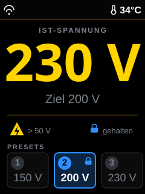
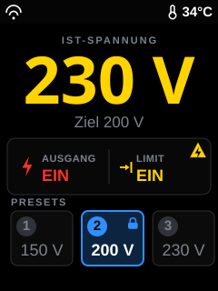
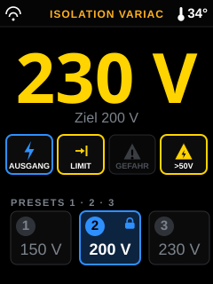

# TFT-Display – Redesign (Arbeitsstand / WIP)

> **⚠️ Work in Progress.** Dieser Ordner sammelt Layout-Entwürfe für das Redesign des
> TFT-Displays (Branch `feature/redesign-display`). Er ist **temporär**: Sobald wir uns
> auf ein finales Layout geeinigt haben, bleibt nur noch **ein** Mockup hier stehen, der
> Rest wird abgeräumt.

## Ziel

Das TFT (240×320, Portrait, ILI9341) soll grafischer werden und die **wichtigen Infos
klar hervorheben**. Bewusst **keine** Anlehnung an die Web-Oberfläche und **keine
Gauge** – die Zeigerinstrumente sitzen bereits auf der Frontplatte. Der Fokus liegt auf:

- **große Ist-Spannung** als zentraler Blickfang, farbcodiert nach Sicherheitszustand,
- **kleiner Zielwert** (Target),
- **Presets nebeneinander** im Look der physischen Taster 1 · 2 · 3, mit Hervorhebung des aktiven Presets,
- **Status-Icons** (Warndreieck, Blitz-im-Dreieck, „gehalten") angelehnt an die Frontplatten-Symbole,
- Icons im Stil der bestehenden 16×16-XBM-Symbole (WLAN, Thermometer aus Paket L).

## Die drei Entwürfe

Alle im selben Szenario, damit die **Layouts** vergleichbar sind (nicht die Daten):
**Ist 230 V · Ziel 200 V · Ausgang EIN · Strombegrenzung EIN (→ Zahlen gelb) ·
Preset 2 aktiv & gehalten · 34 °C · WLAN verbunden**.

<table>
  <tr>
    <th></th>
    <th></th>
    <th></th>
  </tr>
  <tr>
    <td valign="top"><b>A — Spannung als Held</b> 
      Klassisch vertikal. Riesige Ist-Spannung, dünne schwarze Statusleiste oben,
      Icon-Zeile über den Presets.</td>
    <td valign="top"><b>B — Große Statuszeile</b> 
      Prominentes schwarzes Status-Band in der Mitte (Ausgang / Limit). Spannung etwas
      kleiner, dafür Status als Hero-Element.</td>
    <td valign="top"><b>C — Icon-Grid</b> 
      Frontplatten-Metapher: Reihe farbiger Status-Chips wie die echten Taster
      (⚡ / →| / ▲), Presets im Tasten-Look.</td>
  </tr>
</table>

## Farb- & Icon-Logik (in allen Varianten gleich)

| Element | Bedeutung |
| :--- | :--- |
| **Gelbe** Spannung | Strombegrenzung **EIN** |
| **Rote** Spannung | Strombegrenzung **AUS** (Gefahr) |
| Rotes Warndreieck ▲! | erscheint **zusätzlich**, wenn die Strombegrenzung aus ist |
| Blitz-im-Dreieck ▲⚡ | Ausgangsspannung **> 50 V** (Berührungsgefahr) |
| Schloss 🔒 | die Preset-Spannung wird aktuell **gehalten** |
| Blau umrandete Preset-Kachel | aktives Preset (LED) wird auf dem Display hervorgehoben (Blau = zugehöriger Taster) |

## Offene Fragen (bitte vor der Umsetzung klären)

1. **„Statusbar"** – obere Leiste (A/C) oder großes zentrales Status-Band (B)? Welche Deutung war mit „grösser" gemeint?
2. **Spannungsfarbe bei Ausgang AUS** (≈ 0 V): auch gelb/rot, oder neutral grau/weiß?
3. **Presets**: reicht der blaue Rahmen-Highlight fürs aktive Preset, oder soll die aktive Kachel kräftiger gefüllt sein? Spannung (150/200/230 V) zeigen oder nur die Nummer?
4. **Temperatur**: dauerhaft oben, oder nur als Icon bei Warnung?
5. **Zielwert**: direkt unter der Spannung ok, oder woanders (z. B. in die Statuszeile)?

## Nicht vergessen: es gibt mehr als die Hauptanzeige

Die Mockups zeigen den Normalbetrieb. Das Display kennt aber noch weitere Vollbild-Screens
(alle in [`../../src/display.cpp`](../../src/display.cpp)) — wenn nur die Hauptanzeige neu
gestaltet wird, stehen die anderen stilistisch daneben:

| Screen | Funktion | Inhalt |
| :--- | :--- | :--- |
| Normalbetrieb | `drawBackground()` + `drawLegend()` + `updateDisplay()` | Gegenstand der Mockups |
| Einstellungen / Kalibrierung | `drawSettingsScreen()` + `updateSettingsDisplay()` | Enc/Out/P1/P1S/P2/P2S, Warnzeile der Kalibrier-Plausibilität |
| Referenzfahrt | `drawHomingScreen()` | „Homing…", IP-Adresse, Firmware-Version |
| Systemfehler | `drawErrorScreen()` | Fehlerhinweis bei `STATE_ERROR` |
| Voltmeter-Update (#32) | `drawVmUpdateScreen()` + `updateVmUpdateScreen()` | Fortschrittsbalken, Prozent, Statusmeldung, „Variac gesperrt - Ausgang AUS" |
| OTA-Update (#26, **neu in V4.7.0**) | `drawOtaScreen()` + `updateOtaScreen()` | Fortschrittsbalken, Prozent, Firmware/Filesystem, „Gerät nicht ausschalten!" |

Die beiden Update-Screens sind bewusst gleich aufgebaut (gleiche Balkengeometrie), und
beide gehen mit einem gesperrten Variac einher — sie sollten also dieselbe Formensprache
bekommen wie das neue Hauptlayout. Auch relevant: Seit V4.7.0 stellt `forceSafeState()`
beim Sperren einen definierten Zustand her (Ausgang aus, Strombegrenzung ein, Regelung aus,
Preset- und x10-LED aus) — die Statusdarstellung im Redesign sollte diesen Zustand
eindeutig zeigen können.

## Technische Notiz zur Umsetzung

- Icons werden – wie die bestehenden – als **16×16-XBM** in `src/icons.h` abgelegt
  (Material Symbols, Apache-2.0). Neu nötig: Warndreieck, Blitz-im-Dreieck, Limit-Pfeil (→|), Schloss.
- Schriften sind frei wählbar (TFT_eSPI-Fonts 2/4/6/7/8 bzw. Smooth-Fonts).
- **Architektur-Entscheidung**: für flimmerfreie große Grafik/Animation empfiehlt sich der
  Umstieg des `updateDisplay()`-Renderings auf einen **Sprite-Framebuffer** (PSRAM,
  240×320×2 B ≈ 150 KB passen locker). Das ist der größte Umbau und noch offen.

---

*Erzeugt als Diskussionsgrundlage für das Display-Redesign. Die SVGs sind maßstabsgetreu
240×320. Nach der Entscheidung bleibt nur das finale Mockup; die übrigen Dateien und diese
Notizen werden entfernt bzw. auf das gewählte Layout eingedampft.*
