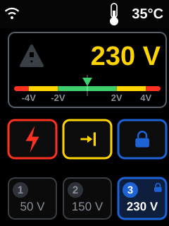
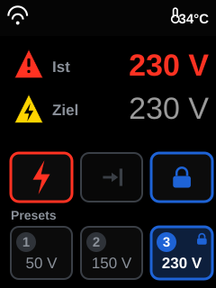
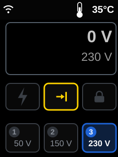
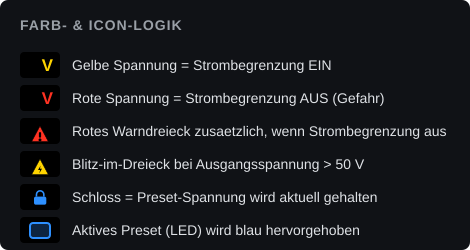

# TFT-Display – Redesign (Beta 2)

> **Status:** Beta 2 — umgesetzt und am Gerät durchiteriert (Branch `feature/redesign-display`,
> aufsetzend auf V4.7.0). Der Normalbetrieb-Screen ist neu gestaltet und läuft; die übrigen
> Vollbild-Screens bleiben vorerst unverändert.

## Ziel

Das TFT (240×320, Portrait, ILI9341) wird grafischer und hebt die **wichtigen Infos klar
hervor**. Bewusst **keine** Anlehnung an die Web-Oberfläche und **keine Gauge** – die
Zeigerinstrumente sitzen bereits auf der Frontplatte. Kernideen:

- **Ist- und Zielspannung** gestapelt, **rechtsbündig** (ohne Labels — Größe/Farbe reichen).
  **Ist** groß + fett + farbcodiert nach Sicherheitszustand; **Ziel** kleiner, **grau** und
  **nicht fett**.
- **Rahmen** (Radius wie Chips, links/rechts an den äußeren Chips ausgerichtet) um Werte +
  Warnfeld — trennt Messwerte vom Bedienbereich und füllt den oberen Rand.
- **Ein gelbes Achtung-Dreieck** (schwarzes „!") — nur bei **ausgeschalteter Strombegrenzung**,
  **hartes Blinken** (an/aus). Kein Dauer-Platzhalter, keine > 50-V-Warnung mehr.
- **Drei bedienbare Chips** (Ausgang · Limit · Regelung): nur das Frontplatten-Symbol,
  leuchtet farbig = EIN, grau = AUS (wie die Taster-LED).
- **Presets** im Look der Taster 1 · 2 · 3; das passende Preset leuchtet blau.
- Glatte Vektor-Schrift (TFT_eSPI-FreeFonts), **Double-Buffering** (Sprite) gegen Flackern,
  Kopfzeile mit WLAN-Symbol + Temperatur.

## Das finale Layout (drei Betriebszustände)

Ein Layout — die Anzeige ändert sich mit dem Zustand:

<table>
  <tr>
    <th></th>
    <th></th>
    <th></th>
  </tr>
  <tr>
    <td valign="top"><b>① Normal (Limit ein)</b> 
      Ausgang + Limit + Regelung EIN. Ist <b>gelb</b>, Ziel grau. <b>Kein</b> Warndreieck.
      Ziel 230 V = Preset 3 → P3 blau (Schloss = Regelung hält).</td>
    <td valign="top"><b>② Ohne Strombegrenzung</b> 
      Limit-Chip grau → Ist <b>rot</b>; das gelbe Achtung-Dreieck (schwarzes „!") erscheint
      und blinkt hart. Regelung weiter EIN.</td>
    <td valign="top"><b>③ Ausgang aus</b> 
      Alle Chips grau, kein Warndreieck, Ist <b>hellgrau</b> (~0 V). Ziel bleibt grau;
      Preset 3 bleibt blau (folgt dem Zielwert).</td>
  </tr>
</table>

## Anzeige-Logik

| Element | Bedeutung |
| :--- | :--- |
| **Ist-Spannung** (groß, fett, rechtsbündig) | **gelb** = Ausgang ein mit Limit · **rot** = ohne Limit · **hellgrau** = Ausgang aus |
| **Zielspannung** (kleiner, **grau**, nicht fett) | rechtsbündig unter der Ist-Spannung |
| **Rahmen** (Radius wie Chips) | umschließt Werte + Warnfeld, links/rechts an den äußeren Chips ausgerichtet |
| **Achtung-Dreieck** (gelb, schwarzes „!") | erscheint **nur** bei ausgeschalteter Strombegrenzung (unabhängig vom Ausgang); **hartes Blinken** (1 s an / 1 s aus), sonst leeres Feld |
| Chips **Ausgang / Limit / Regelung** | nur das Symbol (⚡ / →\| / 🔒 Schloss): leuchtet farbig = **EIN**, grau = **AUS** (wie die Taster-LED) |
| **Preset** blau umrandet | **Zielwert** entspricht dem Preset (auch bei Ausgang aus) |
| **Schloss** (Preset / Regelung-Chip) | die Regelung hält den Wert |
| Kopfzeile | schwarz, nur WLAN-Symbol + Temperatur (kein Titel, keine Trennlinie) |

## Nicht vergessen: es gibt mehr als die Hauptanzeige

Das finale Layout betrifft den Normalbetrieb. Das Display kennt aber weitere Vollbild-Screens
(alle in [`../../src/display.cpp`](../../src/display.cpp)) — wird nur die Hauptanzeige neu
gestaltet, stehen die anderen stilistisch daneben:

| Screen | Funktion | Inhalt |
| :--- | :--- | :--- |
| Normalbetrieb | `drawBackground()` + `drawLegend()` + `updateDisplay()` | Gegenstand dieses Layouts |
| Einstellungen / Kalibrierung | `drawSettingsScreen()` + `updateSettingsDisplay()` | Enc/Out/P1/P1S/P2/P2S, Warnzeile der Kalibrier-Plausibilität |
| Referenzfahrt | `drawHomingScreen()` | „Homing…", IP-Adresse, Firmware-Version |
| Systemfehler | `drawErrorScreen()` | Fehlerhinweis bei `STATE_ERROR` |
| Voltmeter-Update (#32) | `drawVmUpdateScreen()` + `updateVmUpdateScreen()` | Fortschrittsbalken, Prozent, Statusmeldung, „Variac gesperrt - Ausgang AUS" |
| OTA-Update (#26, V4.7.0) | `drawOtaScreen()` + `updateOtaScreen()` | Fortschrittsbalken, Prozent, Firmware/Filesystem, „Gerät nicht ausschalten!" |

Die Update-Screens sollten dieselbe Formensprache bekommen wie das neue Hauptlayout. Seit
V4.7.0 stellt `forceSafeState()` beim Sperren einen definierten Zustand her (Ausgang aus,
Strombegrenzung ein, Regelung aus, Preset-/x10-LED aus) — die Chip-Darstellung im Redesign
zeigt genau diesen Zustand eindeutig an.

## Technische Notiz zur Umsetzung

- **Icons als Zeichenprimitive** (kein XBM): Chips (Blitz, Limit-Pfeil →|, Schloss) und das
  Warndreieck (`fillRoundTri()` = gefülltes Dreieck mit abgerundeten Ecken) mit
  `fillTriangle`/`fillRoundRect`/`fillCircle`. WLAN als `drawSmoothArc`-Fächer, Thermometer als
  Röhre (Umriss) + gefüllter Quecksilbersäule/Kolben.
- **Schriften**: glatte Vektor-FreeFonts — `FreeSansBold24pt7b` (Ist-Spannung),
  `FreeSans18pt7b` (graue Zielspannung, nicht fett), Font 4 (Temperatur). Bei aktivem
  `LOAD_GFXFF` sind sie schon von TFT_eSPI eingebunden — **nicht** erneut includen
  (Doppeldefinition), direkt via `&FreeSansBold…` verwenden.
- **Double-Buffering gegen Flackern**: Ist/Ziel werden in `TFT_eSprite` gezeichnet und in einem
  Rutsch gepusht (statt löschen → neu beschriften). Sprites werden einmal angelegt; Fallback auf
  Direktzeichnen, falls das Anlegen scheitert.
- Farben (RGB565): `TFT_YELLOW`/`TFT_RED` (Warndreieck gelb, „!" schwarz), dunkleres Blau
  (`0x1A9B`, Kontrast zur weißen Preset-Nummer), Hellgrau (Ausgang aus), mittleres Grau
  (`0x9492`) für Ziel, `0x52AA` für den Rahmen.
- **Rendering**: Dirty-Check pro Zone; das Warndreieck-Feld und die Werte-Sprites haben
  **getrennte Bereiche**, damit nichts gegenseitig überschrieben wird.

---

*Die SVGs sind maßstabsgetreu 240×320 und werden aus `scratchpad/gen_final.py` erzeugt.*
