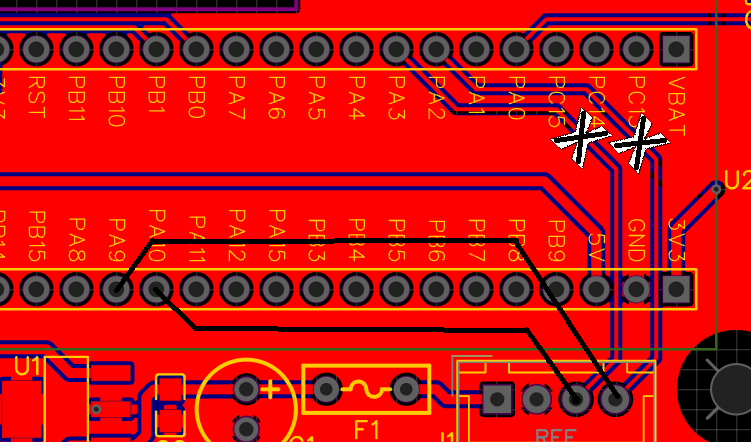

# Hardware-Umbau: Controller-Link auf USART1 (PA9/PA10)

**Stand:** 2026-06-20 · Betrifft: Voltmeter-Print (STM32F103 „Blue Pill")

## Zweck

Die serielle Verbindung zwischen **Voltmeter** und **ESP32-Controller** wurde von
**USART2 (PA2/PA3)** auf **USART1 (PA9/PA10)** verlegt und **bidirektional** ausgeführt.

Gründe:
1. **Befehls-/Antwort-Link:** Der Controller soll künftig Voltmeter-Funktionen (Status, Version,
   Live-Werte, Skalierungsfaktor, Kalibrierung) über die Weboberfläche ansteuern können
   (Backlog Paket J, #27–#29). Dafür wird die Empfangsrichtung am Voltmeter benötigt.
2. **Firmware-Update über den Controller (#30):** Der **eingebaute ROM-UART-Bootloader** des
   STM32F103 liegt auf **USART1 (PA9/PA10)**. Nur über diese Leitung ist ein FW-Update des
   Voltmeters über den Controller ohne eigenen Bootloader möglich (AN3155).
3. **Konsole/Menü** läuft seit Firmware V1.1.0 über die **native USB-CDC** der Blue Pill
   (USB-Port, PA11/PA12) — unabhängig vom Controller-Link. PA9/PA10 sind dadurch frei für den Link.

## Was geändert wurde

- Daten-/Befehlsleitung zum Controller von **PA2/PA3 → PA9/PA10** umverdrahtet.
- **Rückleitung** (Controller → Voltmeter, PA10) ergänzt → Verbindung ist jetzt **bidirektional**.
- Gemeinsames **GND** zwischen Voltmeter und Controller.
- PA2/PA3 werden für den Link nicht mehr verwendet.

## Pin-Belegung

| Signal | Voltmeter (STM32) | Controller (ESP32-S3) | Richtung |
|--------|-------------------|------------------------|----------|
| Daten Voltmeter → Controller | **PA9** (USART1 TX) | GPIO **17** (`Serial1` RX) | →
| Befehle Controller → Voltmeter | **PA10** (USART1 RX) | GPIO **18** (`Serial1` TX) | ←
| Masse | GND | GND | — |

Baudrate: **115200, 8N1**. (Controller: `Serial1.begin(115200, SERIAL_8N1, PIN_RX=17, PIN_TX=18)`;
Voltmeter: `huart1` auf `USART1`.)

> **Cross-over beachten:** TX des einen Geräts geht an RX des anderen (PA9 → GPIO17, GPIO18 → PA10).

## Konsole (unabhängig vom Link)

| Funktion | Pins | Anschluss |
|----------|------|-----------|
| Menü/Debug (`Serial`) | PA11/PA12 | USB-Port der Blue Pill (USB-CDC) |
| Firmware flashen (Entwicklung) | SWDIO/SWCLK | ST-Link (SWD) |

## Layout

Ausschnitt des Print-Layouts mit der beschriebenen Modifikation:
1. Verbindungen zu PA2 und P3 unterbrechen
2. Neue Verbindungen zu PA9 und PA10 legen

## Status

- ✅ Hardware-Umbau ausgeführt (PA9/PA10 + GND, bidirektional).
- ✅ **Senderichtung** (Voltmeter PA9 → Controller) am Gerät verifiziert: Spannung wird im
  Controller angezeigt.
- ⏳ **Empfangsrichtung** (Controller → Voltmeter PA10) noch nicht getestet — wird mit dem
  Befehls-Protokoll #27 verifiziert.

## Verweise

- Firmware-Änderung: [`../CHANGELOG.md`](../CHANGELOG.md) (V1.1.0).
- Backlog-Kontext: [`../../BACKLOG.md`](../../BACKLOG.md) — Paket J (#27–#30).
